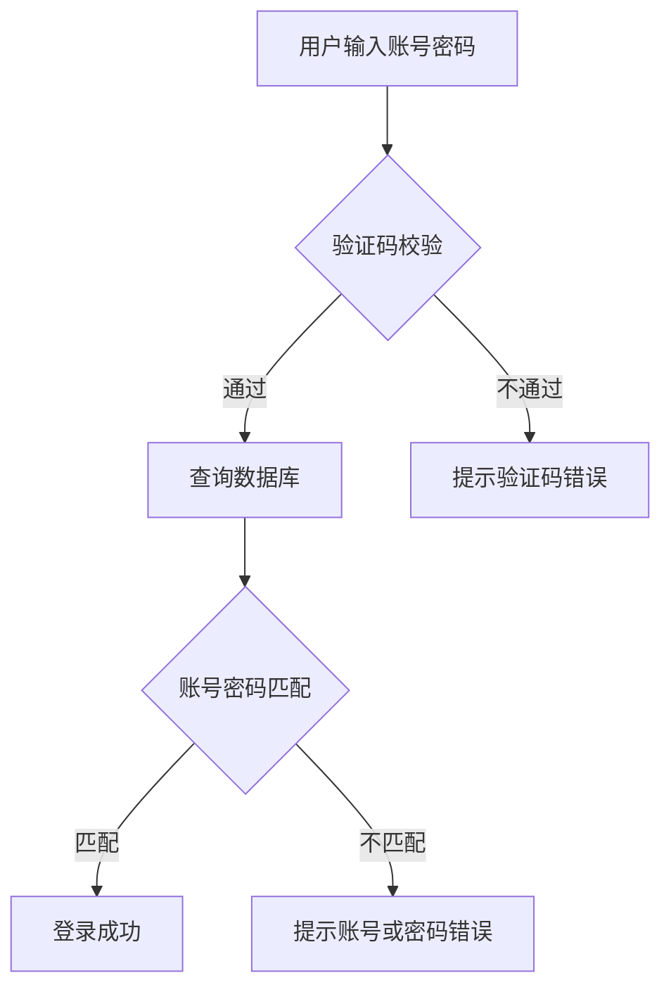

# 使用 Mermaid 和 AI 画流程图

画流程图是写文档和做方案的刚需。传统方式是打开Draw.io手动拖拽，但效率太低。结合AI工具（比如DeepSeek），可以让流程图的制作效率翻倍。

## 1. 推荐工具

- **DeepSeek**：https://chat.deepseek.com — 用来生成Mermaid代码或流程图思路
- **Draw.io**：https://app.diagrams.net — 免费好用的在线流程图工具
- **Mermaid Live Editor**：https://mermaid.live — 在线Mermaid编辑器，所见即所得

## 2. 操作流程

基本思路是：用AI描述需求 → AI生成Mermaid代码 → 粘贴到Mermaid Live预览 → 导出为图片或SVG。

比如你需要画一个用户登录流程，直接告诉DeepSeek："帮我用Mermaid语法画一个用户登录的流程图，包含输入账号密码、验证码校验、登录成功/失败分支"。DeepSeek会生成类似下面的代码：

然后在Draw.io或Mermaid Live中渲染即可。

## 3. 效果截图

## 4. 小技巧

- Mermaid支持流程图、时序图、甘特图、类图等多种图表类型
- 复杂流程图建议先在纸上画草稿，再用AI细化
- Draw.io支持直接粘贴Mermaid代码渲染
