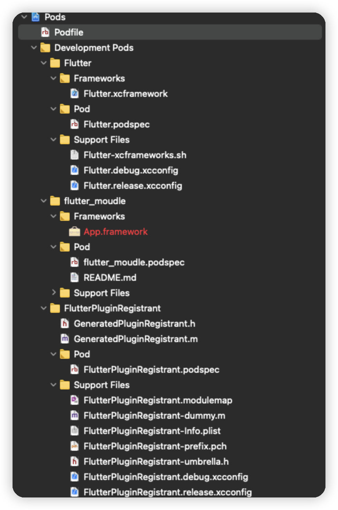
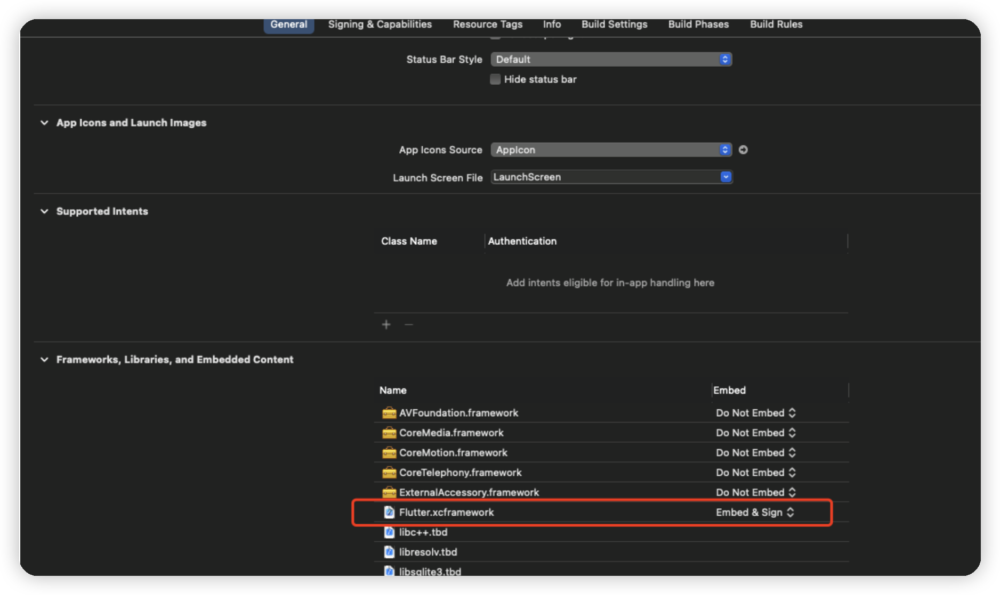

# flutter 与 Object-C 交互开发


## 1.iOS 原有项目集成 flutter

官方文档：[flutter 官方开发文档地址](https://flutter.cn/docs/development/add-to-app/ios/project-setup)

> 1.第一步：首先我们要在同级工程目录 podfile 下创建 flutter 工程。

终端命令：

```
    flutter create --template module my_flutter
```

文件名就是 my_flutter
当然也可以通过 vscode 或者 android studio 来创建此工程在指定位置下。
因为是完整的空 flutter 项目 所以也可以独立运行

> 2.第二步：配置 podfile 文件

在原有 iOS 项目里想要调用 flutter，其实就是一个本地模块。类似与我们 pod 引用本地模块一样的方式。

podfile 配置如下：

在 target '' do 配置上面加上

```
    ## ==============Flutter ==============_
      flutter_application_path = 'flutter_moudle'
      load File.join(flutter_application_path, '.ios', 'Flutter', 'podhelper.rb')
      install_all_flutter_pods(flutter_application_path)

      ## ==============Flutter ==============_
```

flutter_application_path 指向你的 flutter 工程名称，我这里的工程名称是 flutter_moudle 为例。

load File.join(flutter_application_path, '.ios', 'Flutter', 'podhelper.rb')
的含义是指向 flutter_moudle 工程目录下的 .ios/Flutter/podhelper.rb

如果你的工程没有.ios 文件，那你需要用 flutter build ios 命令来初始化 flutter iOS 工程。

之后执行 pod install --verbose

运行成功会在 iOS 工程的 pod 目录下有如图目录：



> 3.第三步：xcode 配置 flutter

在 xcode 的 general 里配置 flutter.xcframework



> 4.AppDelegate 配置

- AppDelegate.h 里添加引用

```
#import <Flutter/Flutter.h>
#import <FlutterPluginRegistrant/GeneratedPluginRegistrant.h>

```

并在 interface 里声明 flutter 引擎对象

```
@property (nonatomic,strong)FlutterEngine *flutterEngine;

```

- AppDelegate.m 里找到 didFinishLaunchingWithOptions 方法。在应用启动完成时添加引擎初始化。

```
    self.flutterEngine = [[FlutterEngine alloc] initWithName:@"my flutter engine"];
     Runs the default Dart entrypoint with a default Flutter route.
    [self.flutterEngine run];

     // Used to connect plugins (only if you have plugins with iOS platform code).

    [GeneratedPluginRegistrant registerWithRegistry\:self.flutterEngine];
    return YES;
```

这里基本就是配置完成了

> 5.调用 flutter 引擎 跳转到 fluter 页面

在你想调用的地方添加

```
FlutterEngine *flutterEngine =
            ((AppDelegate *)UIApplication.sharedApplication.delegate).flutterEngine;

FlutterViewController *flutterViewController =
            [[FlutterViewController alloc] initWithEngine:flutterEngine nibName:nil bundle:nil];

[self.viewController.navigationController pushViewController:flutterViewController animated:NO];

```

直接运行工程就可以看到效果了。

---

## 2.常见集成问题

- 1.编译报错：target 9.0 问题和 undefined method \`flutter_additional_ios_build_settings'

解决方案：
podfile 里将 flutter_additional_ios_build_settings 注释掉即可

```
post_install do |installer|
 installer.pods_project.targets.each do |target|
     target.build_configurations.each do |config|
         config.build_settings['IPHONEOS_DEPLOYMENT_T>ARGET'] = '9.0'
     end
#    flutter_additional_ios_build_settings(target)
 end
end

```

- 2.Xcode Command PhaseScriptExecution failed with a nonzero exit code

解决方案：

清缓存

在 Xcode 菜单栏选择 File -> Workspace Setting -> Build System new Build System(Default) 重新运行即可。
