# Spring学习笔记


## 一、SpringMVC简介


### 1.什么是MVC
MVC是model view controller的缩写，是一种软件架构模式。  

-    Model(模型):项目中用于处理程序数据逻辑的部分,负责在数据库中查找和存储数据。
-    View（试图）：是项目中将得到的数据进行处理之后，显示给用户一个界面的部分。  
-   Controller（控制器）：是项目中处理用户交互的部分，负责读取用户的请求，向模型提价请求，读取模型的响应，将数据交给View部分。   

### 2.什么是SpringMVC
官方的额描述为： Spring Web MVC 是基于Service API的原始web框架，从一开始就包含在Spring框架中。项目的pom.xml文件如下就是Spring mvc的框架
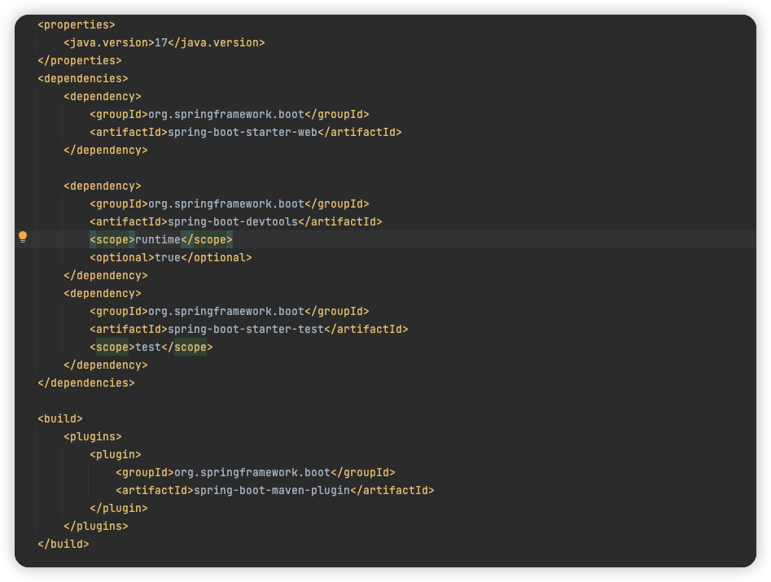

### 3.SpringMVC的特点
Spring MVC项目的创建和Spring boot的创建流程一样，之前创建的Spring Bootx项目就相当于是一个Spring web项目。我们在添加Spring Boot框架的时候，就已经引入了Spring MVC.


##  二、@RequestMapping注解

### 1. 实现客户端和服务端的连接
#### 1.1  @RequestMapping注解
@RequestMapping 是Spring web应用程序中最常用的注解之一，他是来注册接口的路由映射的。

```
 路由映射：所谓的路由映射指的就是，当用户访问一个URL时，将用户的请求对应到程序中某个类的某个方法的过程就叫路由映射。
```
 @RequestMapping注解参数：
 
 ```
 -   value: 指定请求的实际访问地址，value属性是@RequestMapping注解的默认属性，如果只有唯一一个 属性，则可以胜率value字段，如果参数有多个属性，则必须写上value属性名。
 -   path: 与value同义，他们在源码中相互引用，value和path都是用来作为映射使用的。
 -   method: 用来指定请求类型，当在一个方法的注解@RequestMapping的参数中写道method = RequestMethod.GET  表示这个方法只支持GET请求
 -   params：该属性指定，请求中必须包含params属性指定的参数时，才能执行该请求
 -   headers: 该属性指定，请求中包含header值，才能执行该请求 
 -   consumes:指定处理请求的提交内容类型（Content-type），才能执行该请求
 -   produces:指定返回的时内容类型，返回的内容类型必须是request请求中所包含的类型，这个属性还可以指定返回值的类型。
 ```
 
#### 1.2  @RequestMapping的简单使用
 -    @RequestMapping既可以来修饰类，也可以修饰方法，当同时修饰类和方法时，类上的 @RequestMapping注解的参数value/path,表示的是URL中的一级路由，方法上的参数的value/path表示URL的二级路由。
 -     @RequestMapping注解默认情况下支持GET和POST请求。  
 
下面我们创建一个类，来实现客户端和spring程序的连接，使用浏览器来本地请求。验证@RequestMapper 注解既可以修饰类 也可以修饰方法和@RequestMapper注解默认支持GET和 POST请求

```
package com.example.demo2.controller;

import org.springframework.web.bind.annotation.RequestMapping;
import org.springframework.web.bind.annotation.RestController;

@RestController
@RequestMapping("/test")
public class HelloWorldController {
    @RequestMapping("/hello")
    public String showHello() {
        return "sayhello";
    }
}
```
我们使用url为http://localhost:8080/test/hello用apipost进行get和post请求。
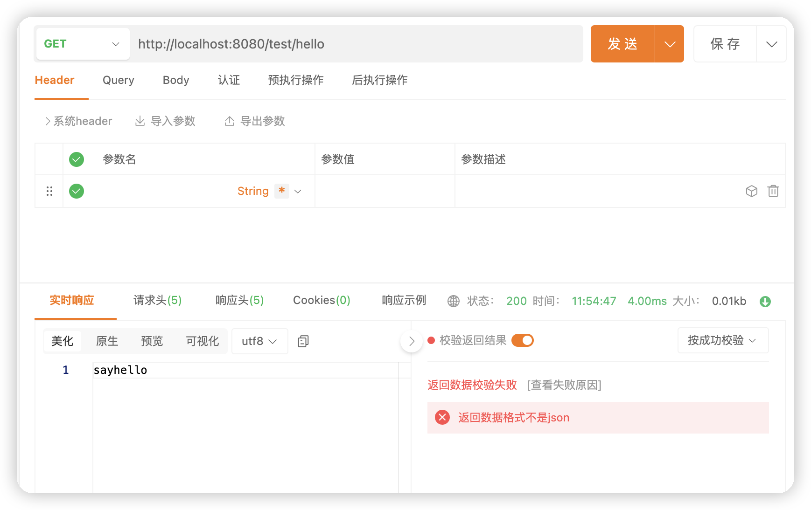
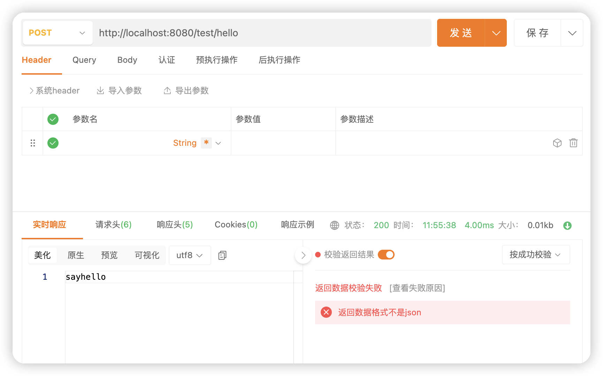
当我们可以设置@ RequestMapping注解的method属性值为RequestMethod.POST,表示这个方法只支持post请求

```
package com.example.demo2.controller;

import org.springframework.web.bind.annotation.RequestMapping;
import org.springframework.web.bind.annotation.RequestMethod;
import org.springframework.web.bind.annotation.RestController;

@RestController
@RequestMapping("/test")
public class HelloWorldController {
    @RequestMapping(value = "/hello",method = RequestMethod.POST)
    public String showHello() {
        return "sayhello";
    }
}
```
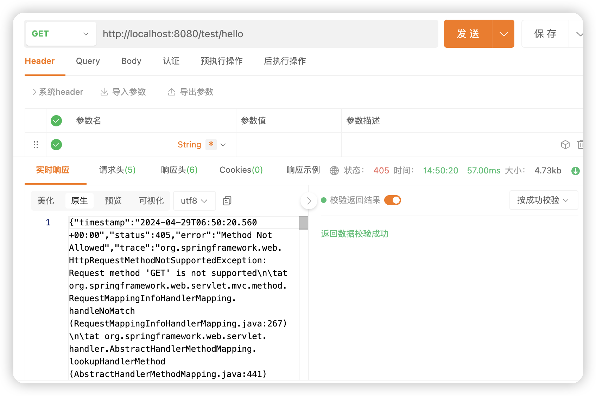
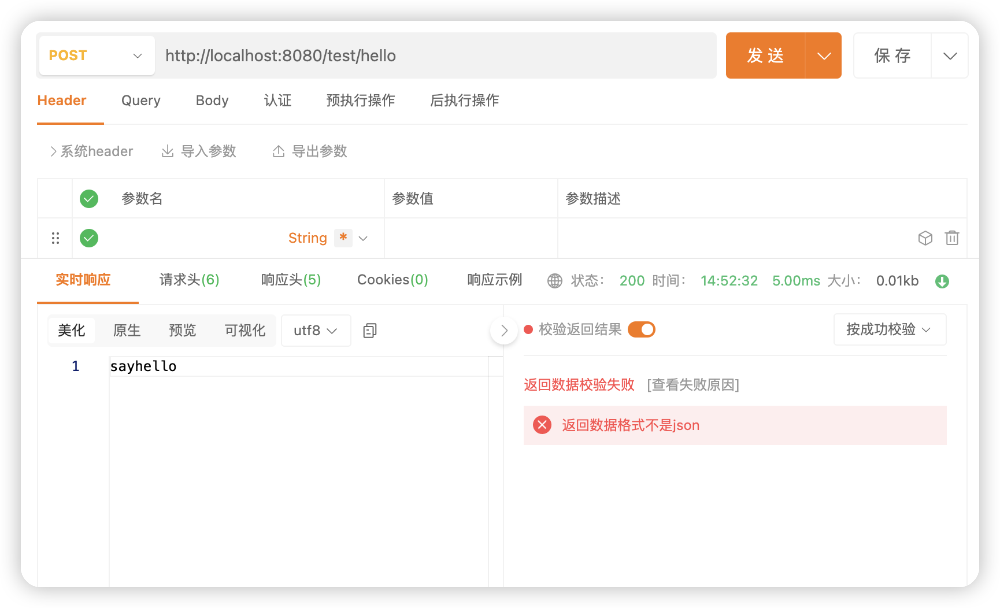
@ RequestMapping 支持设置多级目录

```
    @RequestMapping(value = "/hello/mvc",method = RequestMethod.POST)
```
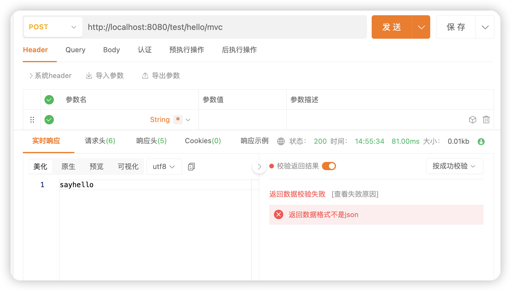
#### 1.3使用@GetMapping和 @PostMapping注解来实现HTTP连接
@GetMapping注解只能实现Get请求，@PostMapping只能实现POST请求.

---
注意⚠️：@GetMapping和@PostMapping 这里只有一个属性value ，不用“/”. 
eg:     @GetMapping("hello") 

---

```
package com.example.demo2.controller;

import org.springframework.web.bind.annotation.GetMapping;
import org.springframework.web.bind.annotation.RequestMapping;
import org.springframework.web.bind.annotation.RestController;

@RestController
@RequestMapping("/test")
public class HelloWorldController {
    @GetMapping("hello")
    public String showHello() {
        return "sayhello";
    }
}

```

### 三、获取参数
#### 1.实现获取单个参数
- 1.使用servlet的写法（getparmeter）来实现获取单个参数

```
package com.example.demo2.controller;

import jakarta.servlet.http.HttpServletRequest;
import org.springframework.web.bind.annotation.GetMapping;
import org.springframework.web.bind.annotation.RequestMapping;
import org.springframework.web.bind.annotation.RestController;

@RestController
@RequestMapping("/test")
public class HelloWorldController {
    @RequestMapping("/getname")
    public String getName(HttpServletRequest request) {
        return "name:" + request.getParameter("name");
    }
}

```
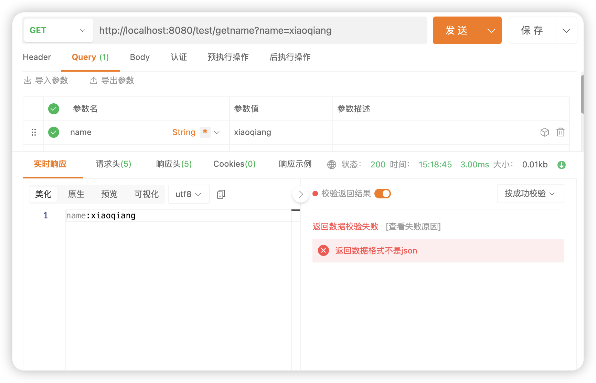

-  2.使用更简单的获取单个参数的方式

```
package com.example.demo2.controller;

import jakarta.servlet.http.HttpServletRequest;
import org.springframework.web.bind.annotation.GetMapping;
import org.springframework.web.bind.annotation.RequestMapping;
import org.springframework.web.bind.annotation.RestController;

@RestController
@RequestMapping("/test")
public class HelloWorldController {
    @RequestMapping("/getname")
    public String getName(String name) {
        return "name:" + name;
    }
}
```
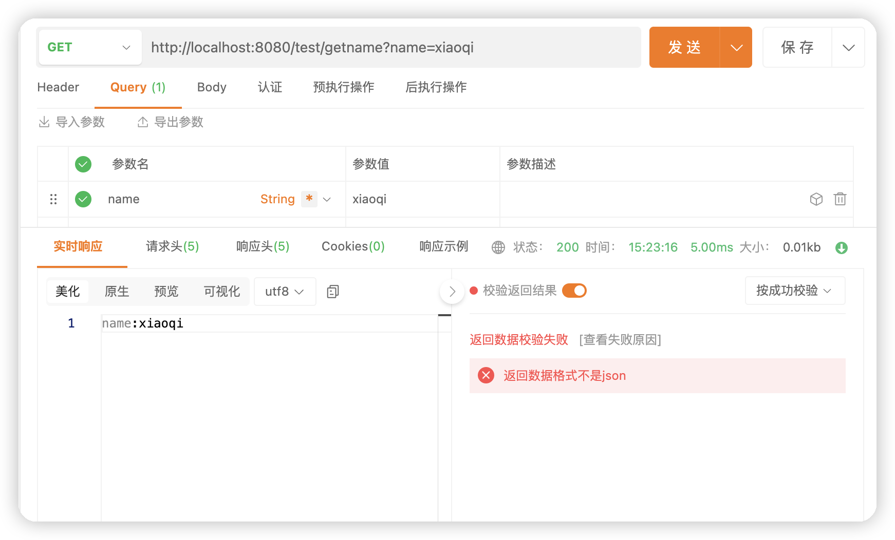
### 2.实现获取对象
上面获取单个参数的方式，当参数个数固定的时候可以使用，但是如果参数个数不确定，随时都需要添加参数的时候，我们这个时候可以使用获取对象的方式来获取参数，前端没有对象的概念，传递的都是对象的属性，后端代码中需要创建一个（eg:用户）类的对象，用来接收前端传递过来的属性的值。

User 类

```
package com.example.demo2.controller;

import org.springframework.stereotype.Component;

@Component
public class User {
    private String name;
    private  int sex;
    private  int id;

    public void setName(String name) {
        this.name = name;
    }

    public String getName() {
        return name;
    }

    public void setId(int id) {
        this.id = id;
    }

    public int getId() {
        return id;
    }

    public void setSex(int sex) {
        this.sex = sex;
    }

    public int getSex() {
        return sex;
    }
}

```
UserController类

```
package com.example.demo2.controller;

import org.springframework.stereotype.Controller;
import org.springframework.web.bind.annotation.*;

@Controller
@ResponseBody
//@RestController
public class UserController {
    @RequestMapping(value = "/user",method = RequestMethod.GET)
    public String submitInfo(User kkk){
        return "name:"+kkk.getName()+"sex:"+kkk.getSex()+"id:"+kkk.getId();
    }
}

```

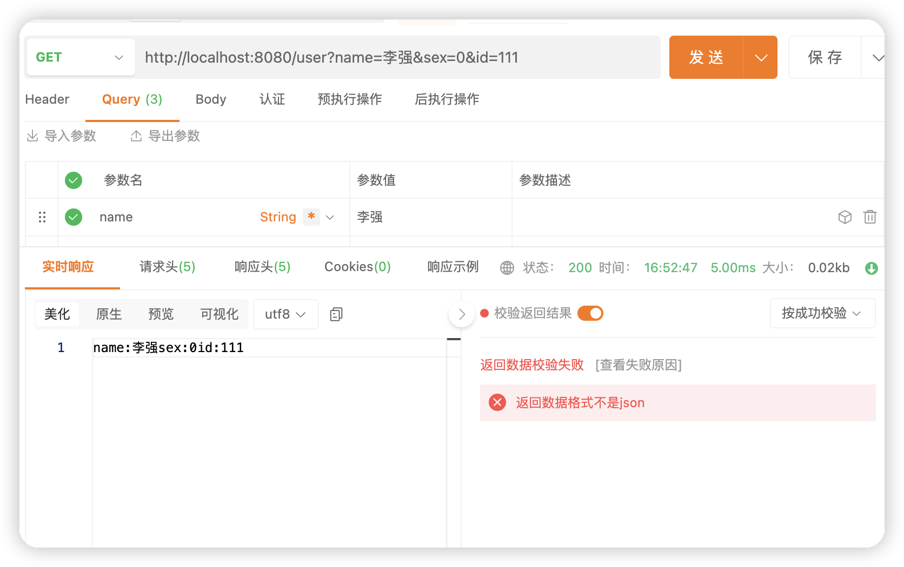

参照上面写法，当然，也可以将对象生命在当前类中，比如声明book类如下

```
package com.example.demo2.controller;

import org.springframework.stereotype.Controller;
import org.springframework.web.bind.annotation.*;

class  Book{
    private  String bookname;

    public void setBookname(String bookname) {
        this.bookname = bookname;
    }

    public String getBookname() {
        return bookname;
    }
}
@Controller
@ResponseBody
//@RestController
public class UserController {
    @RequestMapping(value = "/user",method = RequestMethod.GET)
    public String submitInfo(User kkk){
        return "name:"+kkk.getName()+"sex:"+kkk.getSex()+"id:"+kkk.getId();
    }

    @RequestMapping(value = "/book",method = RequestMethod.GET)
    public String submitInfo(Book mybook){
        return "书名："+mybook.getBookname();
    }
}


```
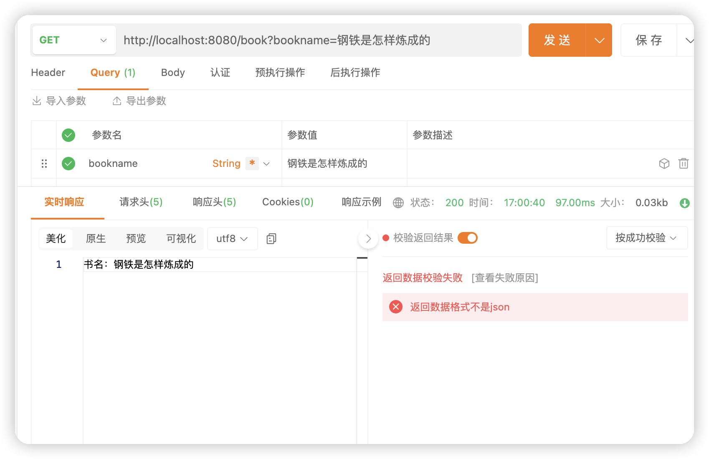

### 3.@RequestParam参数必传设置
使用@RequestParam注解之后，那么这个属性就变成了必传参数了，不传这个参数就会报错，原因是因为@RequestParam注解中有一个required属性等于true，表示这个参数是必传的，我们只需要设置这个属性为false即可解决必传问题

```
@RequestMapping("/name")
    public String name(@RequestParam(value = "n",required = false) String name){
        return name;
    }
```

### 4.接收json对象(@RequestBody)
这里只需要使用@RequestBody就可以拿到前端传递的json对象

```
    @RequestMapping("/addinfo")
    public  User addByJson(@RequestBody User user){
        return user;
    }
```
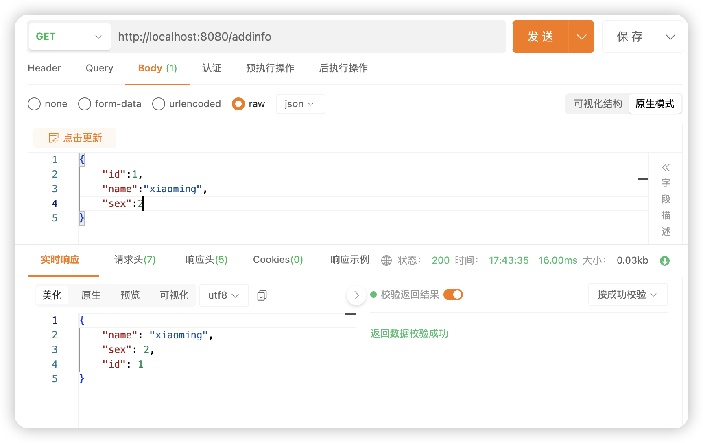

### 5.获取URL中参数（@Pathvariable）
之前我们是通过URL中的查询字符串的部分获取的参数，但有些类似掘金的URL一样：https://juejin.cn/post/7363220159505104923，它没有通过查询字符串的方式传递。

-  1.从前端获取一个参数

```
@RequestMapping("/detail/{id}")
    public Integer detail(@PathVariable("id") Integer id){
        return id;
    }
```
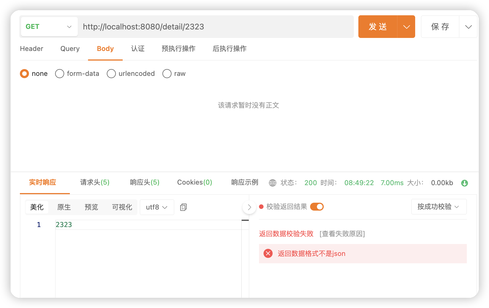
-  2.从前端获取多个参数

```
@RequestMapping("/detail/{id}/{name}")
    public String detail(@PathVariable("id") Integer id,@PathVariable("name") String name){
        return "id:"+id+"name:"+name;
    }
```
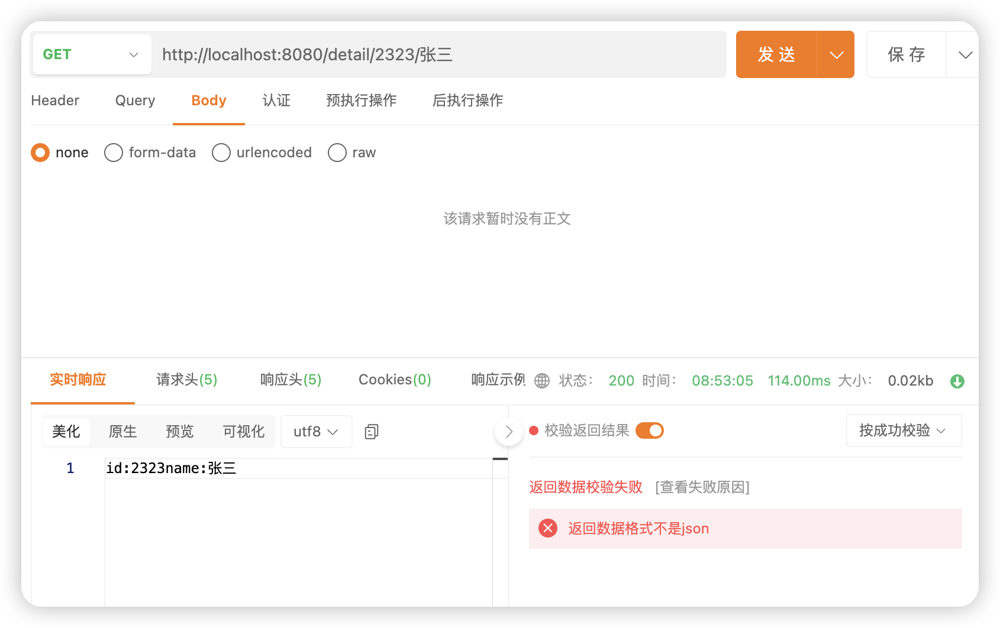

### 6.上传文件
```
@RequestMapping("/file")
    public String upload(@RequestPart("myfile")MultipartFile file) throws IOException {
        String path = "/Users/Documents/dsz111.jpg";
        file.transferTo(new File(path));
        return path;
    }
```
@RequestPart用于将multiparty/form-data类型映射到控制器处理方法的参数中。
这里@RequestPart("file")表示从请求中获取名为"file"的文件，长传的文件将被存储在file对象中。这里代码表示将上传得到的文件存储为dsz111.jpg。
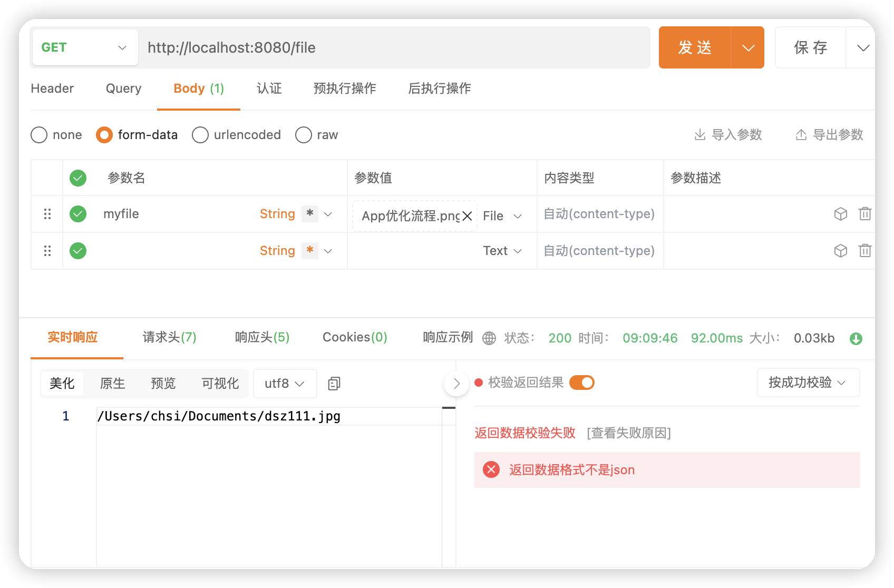
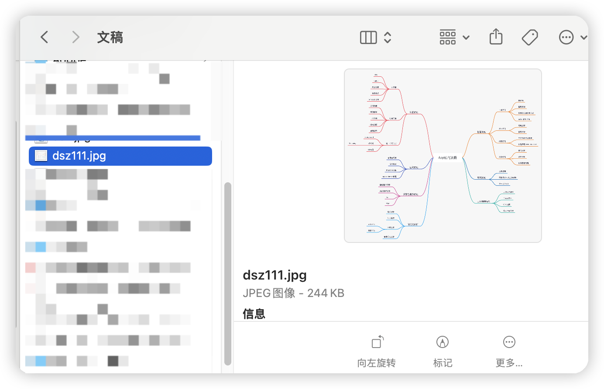
但是这样编写的后端代码存在问题，就是每次访问服务器，服务器保留下的图片名字都一样，这样就会被覆盖掉，只保留下了最后一个文件。这是不完善的。
解决办法为：

```
/**
     * 解决文件覆盖问题
     */
    @RequestMapping("/upload")
    public  String uploadfile(@RequestPart("myfile")MultipartFile file) throws  IOException{
        String name = UUID.randomUUID().toString().replace("-","");
        String fileName = file.getOriginalFilename();
        String fileExtension = new File(fileName).getName().substring(fileName.lastIndexOf(".") + 1);
        System.out.println("name:--------"+name+"file:"+file.getOriginalFilename()+"ext:"+fileExtension);
        String path = "/Users/Documents/"+name;
        file.transferTo(new File(path+"."+fileExtension));
        return path;
    }
```
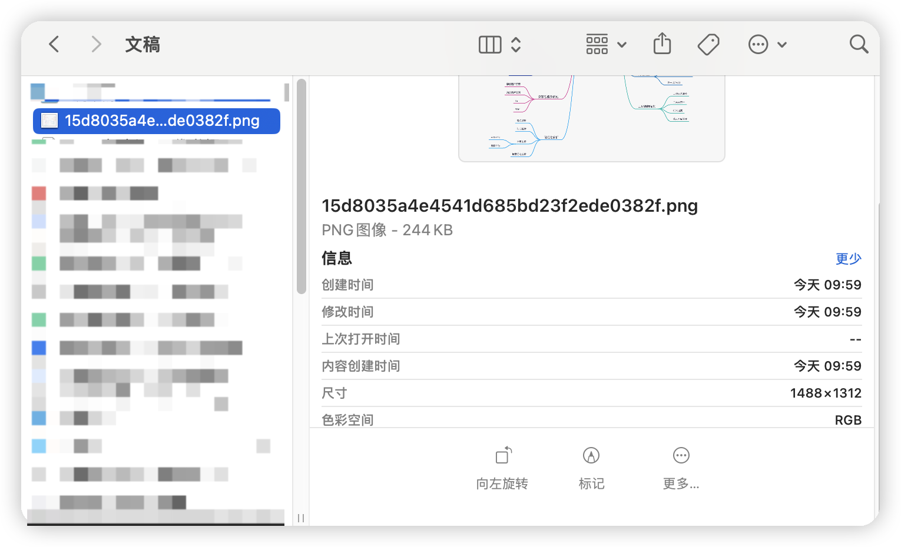


<!--##### 本文参考网站：https://blog.csdn.net/m0_73067372/article/details/132219027
-->