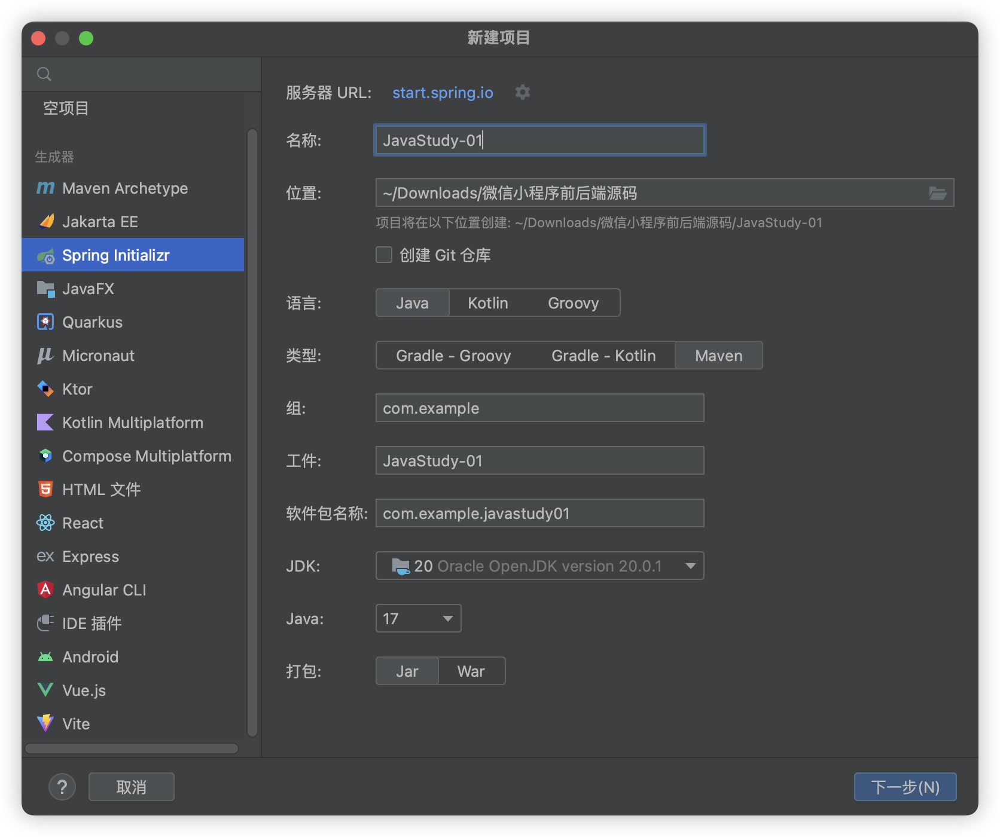
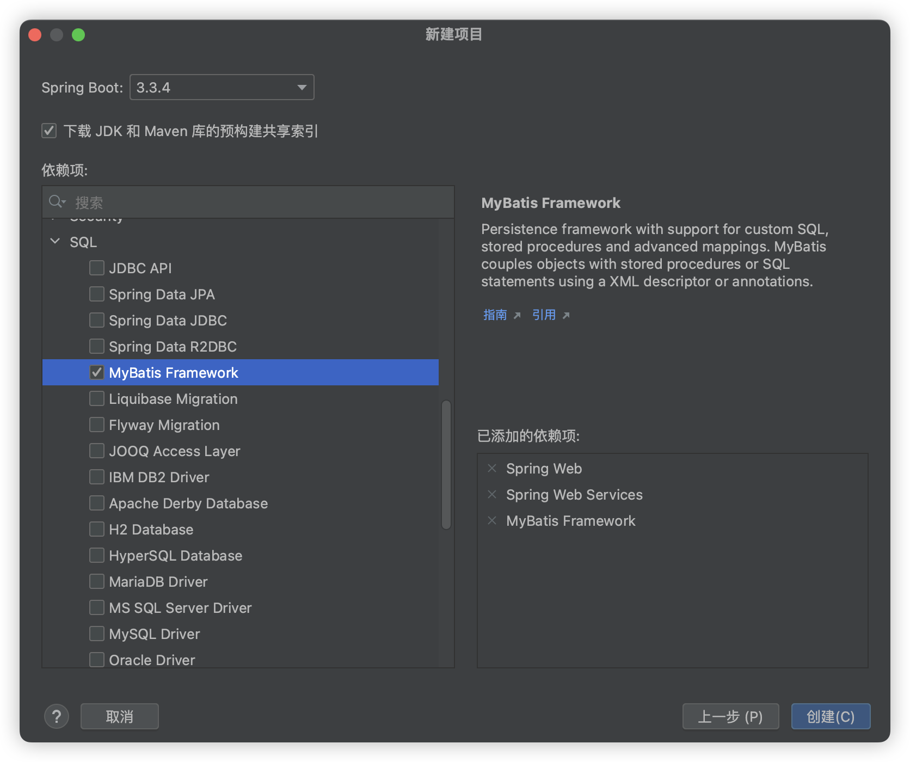

# IntelliJ IDEA新建java项目的框架了解

选择maven, java，之后选择Spring web , Spring web Services, JDBC API.



## 网络请求
在创建Java Web项目时，选择Spring Web和Spring Web Services是必要的。‌

- Spring Web
Spring Web模块提供了Spring MVC和Spring WebSocket的支持，使得开发Web应用程序变得更加简单。选择Spring Web模块，你可以方便地使用Spring MVC来处理HTTP请求和响应，包括RESTful风格的API开发。此外，Spring Web还包含了必要的依赖和配置，帮助你快速启动和运行Web应用。
- Spring Web Services
Spring Web Services模块则主要用于开发SOAP和RESTful Web服务。如果你需要开发Web服务，特别是需要与SOAP协议兼容的服务，选择Spring Web Services模块是必要的。这个模块提供了开发Web服务的所有必要支持和配置。

综上所述，如果你打算开发一个需要处理HTTP请求和响应的Web应用，并且可能需要开发Web服务，那么在创建项目时选择Spring Web和
Spring Web Services这两项是非常重要的步骤。

## 数据库
### JDBC 

**优点**:

- 直接与数据库交互，没有额外的中间层，性能较高。对于一些对性能要求极高、功能非常简单的场景，JDBC 可以直接高效地执行 SQL 语句，减少了中间环节的开销。
- 完全掌控 SQL 语句的执行，能够根据具体需求精细地调整 SQL，适用于复杂的数据库操作和特定的优化需求。例如，可以直接编写复杂的多表连接查询、存储过程调用等。
 
**缺点**:

- 开发效率低‌：需要手动编写大量的代码处理数据库连接、SQL执行、结果集处理和异常处理，代码繁琐且重复性高。
- 资源管理复杂‌：数据库连接管理较为复杂，容易出现资源泄漏等问题。


###  Mybatis
Mybatis是一个支持普通SQL查询、存储过程和高级映射的持久层框架。Mybatis消除了几乎所有的JDBC代码和参数的手工设置以及结果集的检索。Mybatis使用XML或注解来配置和映射原生信息，将接口和Java的POJOs（Plain Old Java Objects，简单的Java对象）映射成数据库中的记录。Mybatis的灵活性很高，可以编写复杂的SQL语句，并且易于维护和调试。

**优点**:
提高开发效率。通过 XML 配置文件或注解的方式，简化了数据库操作的代码。开发者只需关注 SQL 语句的编写和结果集的映射，无需处理底层的数据库连接和资源管理等问题。
支持动态 SQL。可以根据不同的条件动态生成 SQL 语句，提高了 SQL 的灵活性和可维护性。例如，可以根据传入的参数决定是否添加 WHERE 子句中的条件。
提供了对象关系映射功能，能够方便地将数据库表中的数据映射为 Java 对象，反之亦然。简化了数据的存取操作，提高了代码的可读性和可维护性。
易于维护和扩展。SQL 语句与 Java 代码分离，使得 SQL 的修改和优化不影响 Java 代码，同时也方便团队中不同角色的人员进行开发和维护。

**缺点**:
相对于直接使用 JDBC，可能会有一些性能损失。由于 MyBatis 增加了一些中间层的处理，在某些情况下可能会比纯 JDBC 稍微慢一些。但在大多数实际应用场景中，这种性能损失通常是可以接受的。
对于非常复杂的 SQL 优化，可能不如直接使用 JDBC 灵活。虽然 MyBatis 也支持手写 SQL，但在一些极端情况下，可能需要更底层的数据库操作才能实现最佳性能。

###  Mysql 
是一个持久层框架，用于简化Java与数据库之间的交互。它提供了一种映射器(Mapper)，将SQL语句和Java方法映射起来，简化了数据库操作。

### JDBC  Mysql  Mybatis三者对比：
- JDBC 直接与数据库进行交互，需要自行处理SQL语句和结果集的映射。

- MyBatis 是一个半自动化的ORM（对象关系映射）工具，它可以简化数据库操作，但需要手动或通过XML配置文件来编写SQL语句。
 近两年，出现了一个MyBatis Plus 可以省去配置xml的步骤，可自行了解。
 
## 代码案例
 
``` JDBC使用demo
import java.sql.Connection;
import java.sql.DriverManager;
import java.sql.PreparedStatement;
import java.sql.ResultSet;
 
public class JdbcExample {
    public static void main(String[] args) throws Exception {
        String url = "jdbc:mysql://localhost:3306/mydb";
        String username = "root";
        String password = "password";
 
        Connection conn = DriverManager.getConnection(url, username, password);
        String sql = "SELECT * FROM mytable WHERE id = ?";
        PreparedStatement stmt = conn.prepareStatement(sql);
        stmt.setInt(1, 1);
 
        ResultSet rs = stmt.executeQuery();
 
        while (rs.next()) {
            System.out.println(rs.getString("column_name"));
        }
 
        rs.close();
        stmt.close();
        conn.close();
    }
}
```

``` java文件
// Mapper接口
public interface UserMapper {
    User selectUserById(int id);
}
```

``` xml文件
<!-- UserMapper.xml -->
<mapper namespace="UserMapper">
    <select id="selectUserById" resultType="User">
        SELECT * FROM users WHERE id = #{id}
    </select>
</mapper>
```
``` java文件
SqlSessionFactory sqlSessionFactory = new SqlSessionFactoryBuilder().build(configuration);
try (SqlSession session = sqlSessionFactory.openSession()) {
    UserMapper mapper = session.getMapper(UserMapper.class);
    User user = mapper.selectUserById(1);
    System.out.println(user.getName());
}
```
最终还是选择用Mybatis来进行处理和数据库的连接。

## Maven
Maven作为一个构建工具，不仅能帮我们自动化构建，还能够抽象构建过程，提供构建任务实现;它跨平台，对外提供了一致的操作接口，这一切足以使它成为优秀的、流行的构建工具。
Maven不仅是构建工具，还是一个依赖管理工具和项目管理工具，它提供了中央仓库，能帮我自动下载构件。
<font style='color:red'> 主要用作依赖库的管理 </font>


