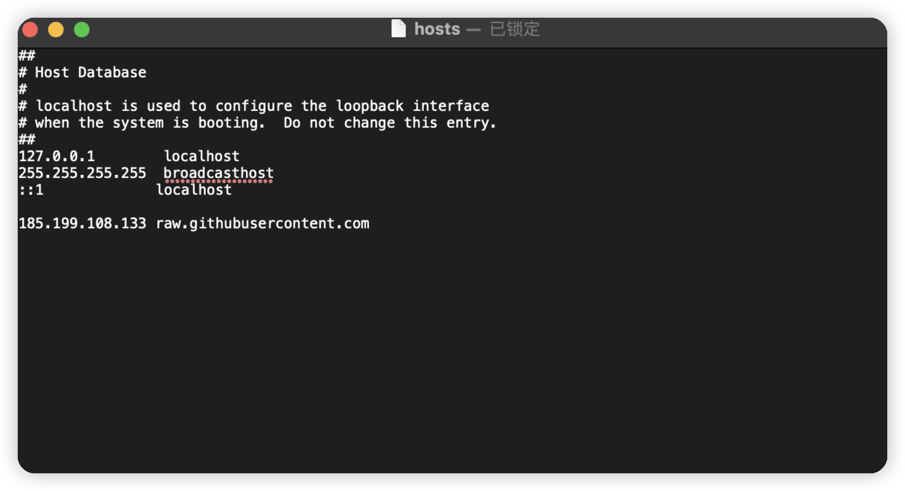
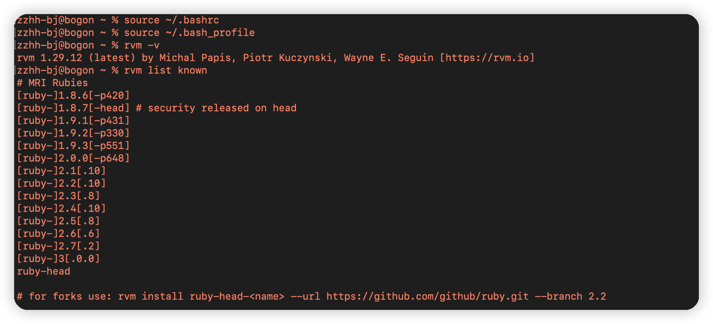
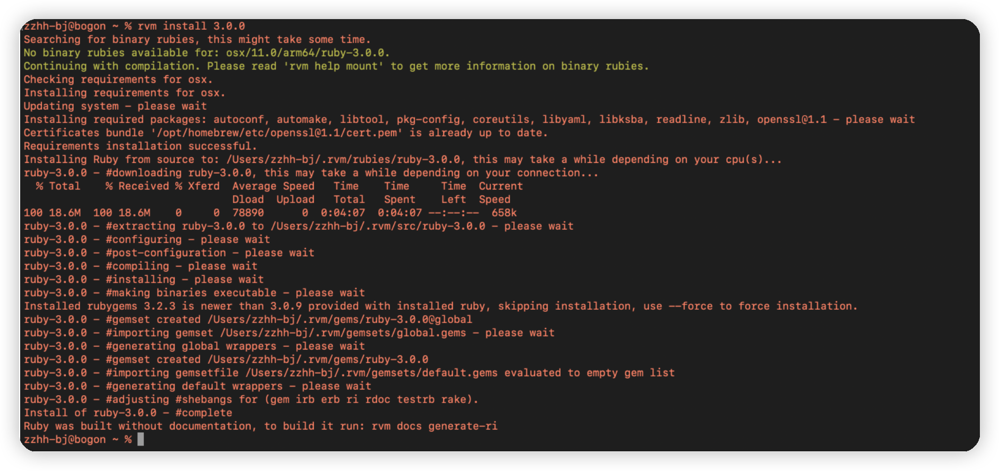
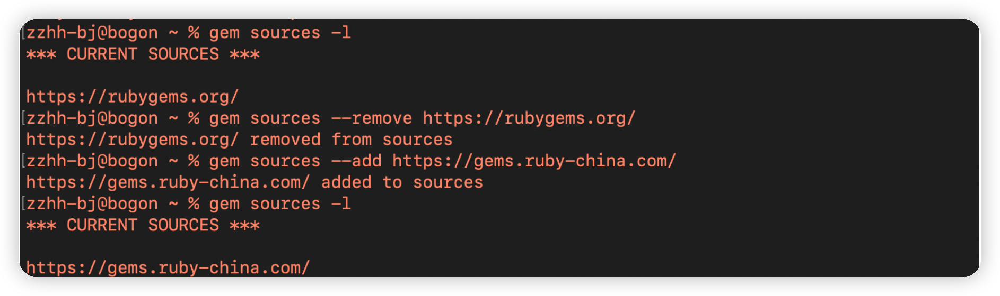

# iOS-Cocoapods安装失败修复记录

## 1.升级ruby

### 步骤一：

*   查看ruby版本
*   ruby  -v

### 步骤二

*   删除旧版本的CommandLineTools

```
removing the old tools (\$ rm -rf /Library/Developer/CommandLineTools)
```

```
install xcode command line tools again (\$ xcode-select --install).
```

### 步骤三

*   安装brew
```
/bin/bash -c "\$(curl -fsSL <https://raw.githubusercontent.com/Homebrew/install/master/install.sh>)"
```

如果报错 `Failed to connect to raw.githubusercontent.com port 443`
可以将raw\.githubusercontent.com 复制到 [https://www.ipaddress.com](https://www.ipaddress.com/) 查询
然后修改hosts  如下




然后再重新运行
```
/bin/bash -c "$(curl -fsSL https://raw.githubusercontent.com/Homebrew/install/master/install.sh)"
```
如果出现error
` curl: (7) Failed to connect to raw.githubusercontent.com port 443: Operation timed out`
可以更换brew源如下 具体可参考 [mac下镜像飞速安装Homebrew教程](https://zhuanlan.zhihu.com/p/90508170)

```
/bin/bash -c "$(curl -fsSL https://cdn.jsdelivr.net/gh/ineo6/homebrew-install/install.sh)"

```

如果用这个方法 需要设置path路径
```
    ==> Next steps:
    - Add Homebrew to your PATH in /Users/zzhh-bj/.zprofile:
        echo 'eval "$(/opt/homebrew/bin/brew shellenv)"' >> /Users/zzhh-bj/.zprofile
        eval "$(/opt/homebrew/bin/brew shellenv)"
```
brew help测试下 功能可以用 就安装完成了。

### 步骤四

以下命令安装rvm
```
curl -L get.rvm.io | bash -s stable 
source ~/.bashrc
source ~/.bash_profile
```
查看rvm版本
```
rvm -v
```
查看已知可安装的ruby版本
```
rvm list known
```



选择一个版本安装  我这里选的是最新的3.0版本
```
rvm install 3.0.0
```



rvm 设置默认版本
```
rvm use 3.0.0  --default
```
更新gem

```
sudo gem update --system

```

查看sources源
```
gem sources -l
```


### 步骤五(安装cocoapods)

## 2.安装cocoapods

OS X 10.11之前系统的安装cocoapods 指令

```
sudo gem install cocoapods
```

OS X 10.11以后系统的安装cocoapods 指令

```
sudo gem install -n /usr/local/bin cocoapods
```

初始化

```
pod setup

```

*   设置清华源trunk

```
git clone https://mirrors.tuna.tsinghua.edu.cn/git/CocoaPods/Specs.git  ~/.cocoapods/repos/trunk

```

或设置master

```
git clone https://github.com/CocoaPods/Specs.git ~/.cocoapods/repos/master
```
