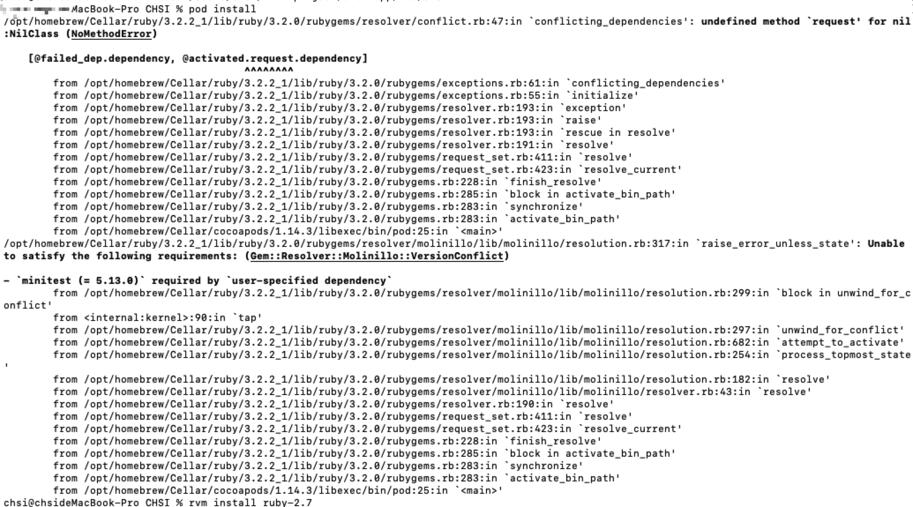
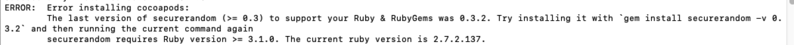
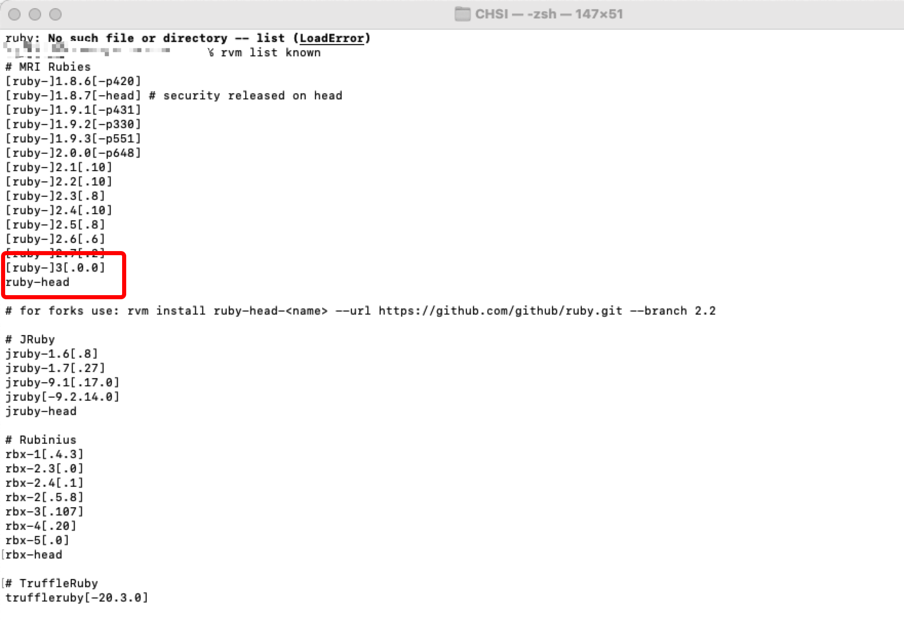
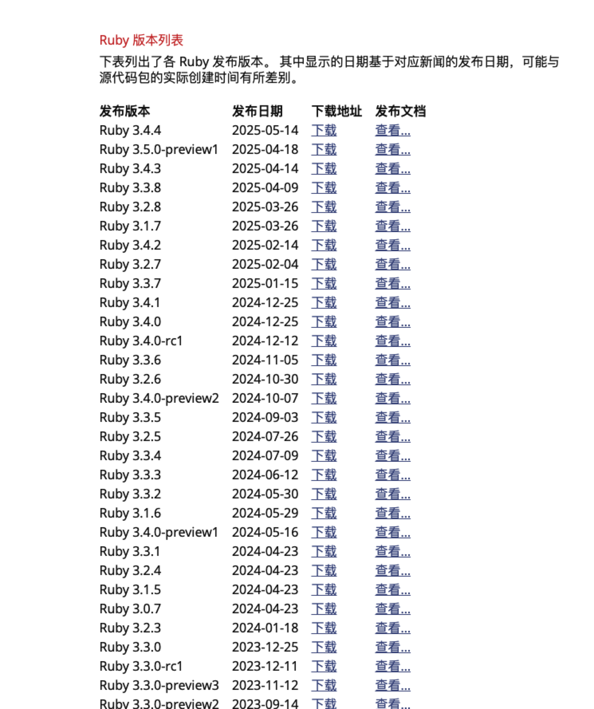
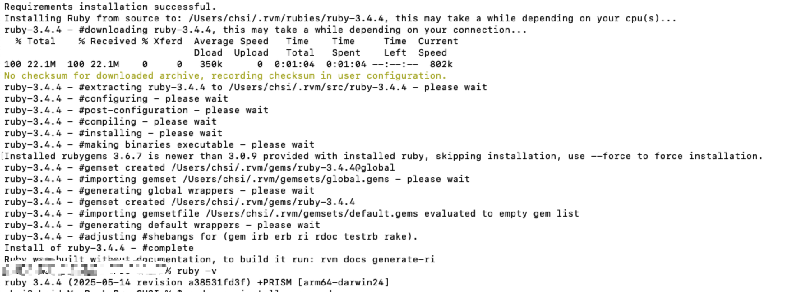
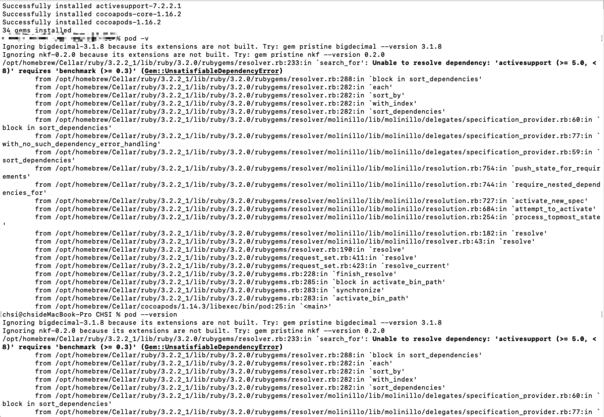
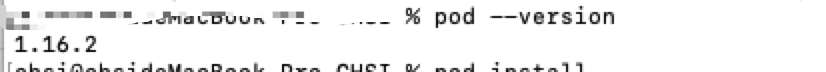

# 解决 ruby 和 cocoapods 版本冲突

## 问题记录

执行 pod install 时出现如下：



执行命令
`gem install cocoapods --user-install ` 重装 cocoapods

重装之后报错：



根据提示可知，需要 securerandom >= 0.3 来支持 ruby，可支持的 ruby 版本在 3.1.0 以上
所以思路很明确，需要两步命令：

- 1.升级 securerandom 到 0.3 以上版本
  首先按照运行命令
  `gem install securerandom -v 0.3.2` 执行，将 securerandom 升级到 0.3.2
- 2.升级 ruby 到 3.1.0 以上版本
  `rvm list known` 可以查看可安装版本
  

这里找不到我们需要的版本，所以推测这个命令是看不到最新版本的，所以建议直接去 ruby 的官网查看



可以看到已经支持到 3.4.4 了，所以我们直接更新最新的就好。
安装完成!



到这里基本 ruby 的问题就是彻底解决了，然后我们重新安装 cocoapods，确保 cocoapods 也是最新的

`sudo gem install cocoapods `

执行之后如果发现仍报错，不要慌，仔细看提示



这里提示，让我们试着执行命令：

`gem pristine bigdecimal --version 3.1.8 `

照着执行后，我们重新使用 cocoapods 命令：

`pod --version `

可以看到已经成功~



当重新打开终端，查看 ruby 版本，发现又回到 ruby 旧版本时，就是没有把新下载的 ruby 设置成默认版本，可以使用以下命令强制刷新环境变量：

`source ~/.zshrc `
`source ~/.bash_profile`

如果仍然无效，可以使用 ruby 版本管理工具来设置默认 ruby 版本 （通常使用 RVM 或者 rbenv）我个人更习惯用 RVM

- 方案一 使用 rbenv

```
# 列出所有已安装的 Ruby 版本
rbenv versions

# 设置全局默认版本（例如 3.4.4）
rbenv global 3.4.4

# 验证当前版本
ruby -v

```

- 方案二 使用 RVM

```
# 列出所有已安装的 Ruby 版本
rvm list

# 设置默认版本（例如 3.4.4）
rvm use 3.4.4 --default

# 验证当前版本
ruby -v
```

cocopods 依赖于 ruby, 问题到此就彻底解决了 ruby 和 cocoapods 的版本冲突问题。
