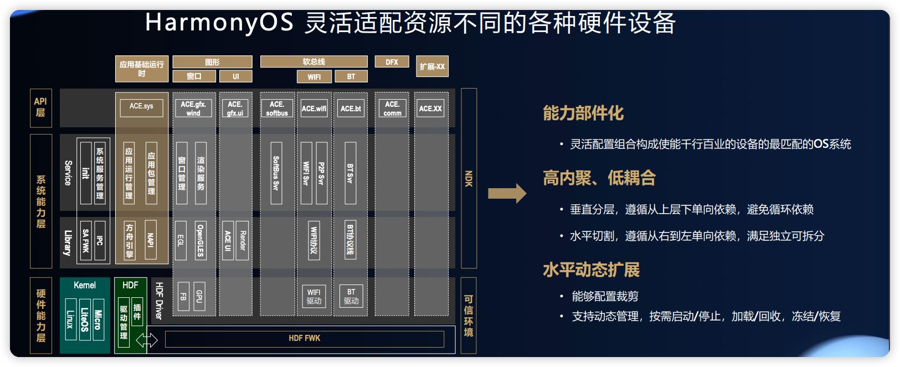
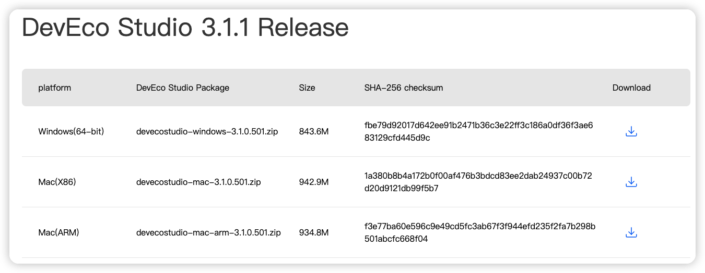
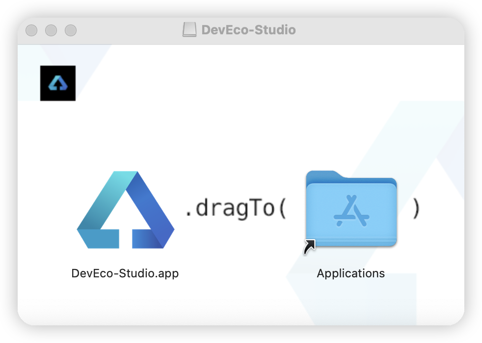
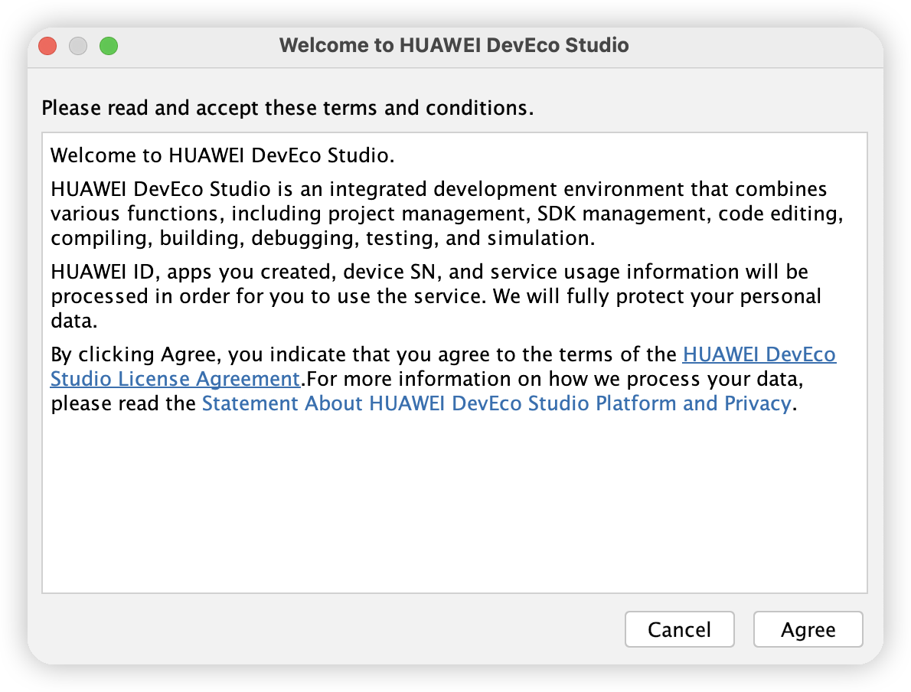
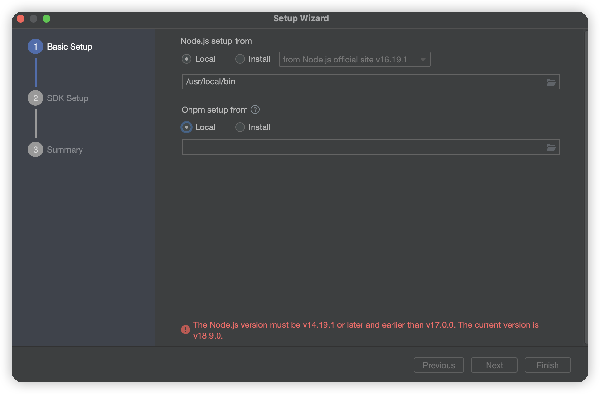
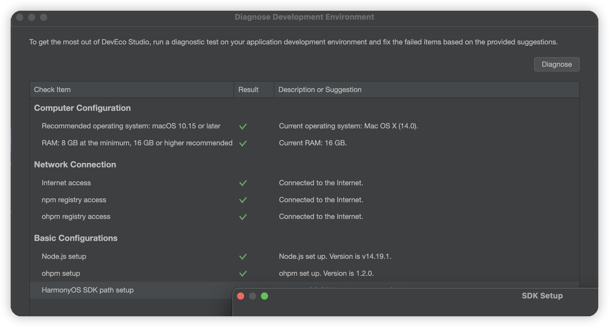
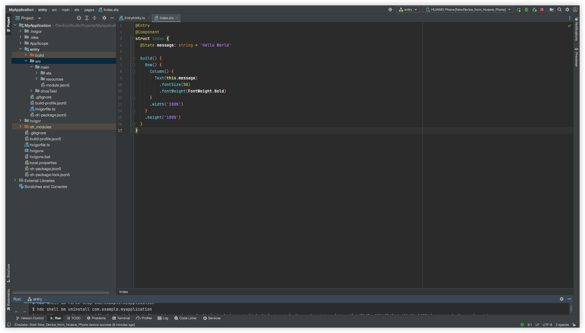

# 鸿蒙开发使用语言
鸿蒙OS开发支持多种编程语言，开发这可以根据自身技术背景和项目需求选择合适的语言进行开发。
鸿蒙支持的编程语言，如Java、Kotlin、JavaScript（可能通过ArkUI框架）以及TypeScript（可能用于鸿蒙的轻量化应用开发）等。探究各语言在鸿蒙生态中的角色，以及对应的开发框架或库，如Java与Java UI框架、Kotlin与相关库、JavaScript/TypeScript与ArkUI或Quick App等。
目前鸿蒙OS主要支持以下语言：
1.Java
比较广泛使用的一种语言
2.C/C++
 主要用于在鸿蒙系统中进行系统级别的开发和底层驱动的编写
3.JS（JavaScript）
可用于进行鸿蒙系统中的Web应用或跨平台应用开发。

# 开发文档
 [开发文档传送门](https://developer.huawei.com/consumer/cn/doc/harmonyos-guides-V2/start-overview-0000001478061421-V2)

# 了解鸿蒙架构

# 下载开发工具
从官网 [deveco-studio](https://developer.huawei.com/consumer/cn/deveco-studio/)下载deveco-studio





# mac  node 降级


我的电脑配置是 mac m1芯片，当出现这个问题后，我去终端命令查了下
```
node -v 
v18.9.0
```

发现确实版本过高了，所以打算按照提示要求降低到17.0.0，以下是降级命令
```
sudo npm install n -g
sudo n stable (此命令可忽略，只为查看最新node版本，并无什么意义)
sudo n 17.0.0 （安装17.0.0）
```


重新 node -v 就发现已经是 v17.0.0了。easy~
配置环境 



环境按照推荐配置完后，就来到了创建工程步骤




# 手机模拟器/真机运行
按照模拟器的配置，只有模拟器的SDK下载将近2G文件，其他倒都很好配置。
配置好如下：


建立的空工程，然后运行模拟器，可以看到hello world的起始工程已经完美运行了。


