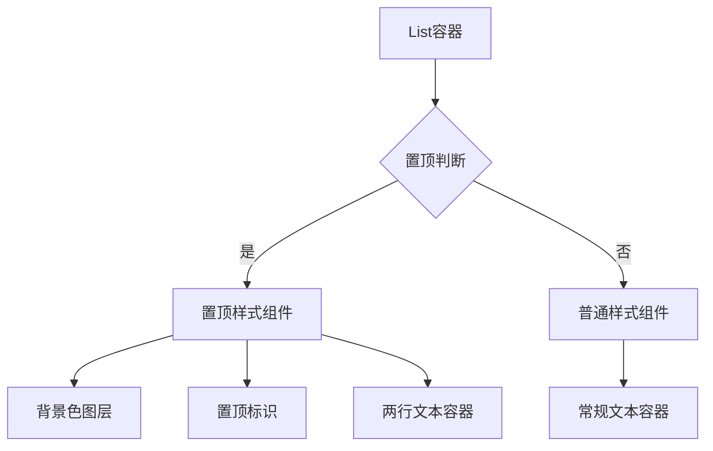

# 鸿蒙 ArkTS 多行文本布局难题：巧用背景色实现新闻置顶与精准对齐

## 一、需求背景与技术挑战

在新闻类应用开发中，置顶新闻的视觉呈现是高频需求。近期接到一个具有典型性的 UI 开发任务：需在鸿蒙 ArkTS 框架下实现新闻标题的置顶样式，具体要求如下：

1. **视觉标识**：标题前添加红色「置顶」标签
2. **布局规范**：
   - 最多显示两行文本
   - 第二行必须严格左对齐屏幕边缘
   - 文本溢出显示省略号
3. **交互要求**：置顶项需有差异化背景色


## 二、技术难点分析

### 难点 1：多行文本对齐机制

鸿蒙 ArkTS 的 Flex 布局默认采用**内容自适应对齐**，当文本换行时，第二行起始位置会继承父容器的对齐方式。若直接使用 Span 组件，会遇到以下问题：

```typescript
// 错误示范：第二行文本缩进问题
Text() {
  Span('[置顶]')
    .fontColor(Color.Red)

  Span('长文本内容...')
}
.maxLines(2)
```

### 难点 2：Span 组件能力限制

通过官方文档验证，Span 组件存在以下关键限制：

- ❌ 不支持 margin/padding 属性
- ❌ 无法直接设置背景边框
- ❌ 文本装饰样式有限

## 三、方案选型与技术验证

### 方案 1：Text 嵌套 Span（失败）

```typescript
Text() {
  Span('[置顶]')
    .textBackgroundStyle({
      color: Color.Yellow,
      radius: 4
    })

  Span('新闻内容...')
}
.maxLines(2)
```

**缺陷分析**：

- 背景色区域无法精确控制
- 多行文本第二行产生缩进
- 间距调整依赖 letterSpacing hack

### 方案 2：独立 Text 组件布局（失败）

```typescript
Row() {
  Text('[置顶]')
    .border({ width: 1, color: Color.Red })

  Text('新闻内容...')
    .maxLines(2)
}
```

**缺陷分析**：

- 边框破坏视觉统一性
- 多设备适配困难
- 两行文本对齐失准

### 方案 3：背景色填充方案（成功）

```typescript
// 置顶项容器
Row() {
  Column() {
    Text('[置顶]')
      .fontColor('#FF4500')
      .fontSize(12)

    Text(content)
      .maxLines(2)
      .textOverflow(TextOverflow.Ellipsis)
  }
  .padding(10)
}
.width('100%')
.backgroundColor('#FFFACD')
.alignItems(HorizontalAlign.Start) // 关键对齐设置
```

## 四、最终实现方案

### 4.1 组件结构设计



### 4.2 核心实现代码

```typescript
// 样式复用装饰器
@Extend(Text) function newsTitleStyle() {
  .fontSize(16)
  .maxLines(2)
  .textOverflow(TextOverflow.Ellipsis)
  .textAlign(TextAlign.Start)
}

// 置顶项组件
@Builder NewsTopItem(item: NewsItem) {
  Row() {
    Column() {
      Text('[置顶]')
        .fontColor('#FF4500')
        .fontSize(12)
        .margin({ bottom: 4 })

      Text(item.title)
        .newsTitleStyle()
    }
    .padding(10)
  }
  .width('100%')
  .backgroundColor('#FFFACD')
  .borderRadius(8)
  .alignItems(VerticalAlign.Top) // 垂直对齐控制
}

// 列表容器优化
List({ space: 8 }) {
  ForEach(this.newsList, (item: NewsItem) => {
    ListItem() {
      if (item.isTop) {
        this.NewsTopItem(item)
      } else {
        Text(item.title)
          .newsTitleStyle()
          .padding(10)
      }
    }
  })
}
.scrollBar(BarState.Auto)
```

## 五、技术原理剖析

### 5.1 对齐控制机制

通过组合使用以下属性实现精准对齐：

```typescript
.alignItems(HorizontalAlign.Start)   // 主轴对齐
.justifyContent(FlexAlign.Start)     // 交叉轴对齐
.textAlign(TextAlign.Start)          // 文本对齐
```

### 5.2 布局计算过程

1. Row 容器设置 100%宽度
2. Column 内部实现纵向堆叠
3. 文本组件启用 maxLines 限制
4. 背景色图层自动扩展填充

## 六、最佳实践建议

1. **样式复用**：使用`@Extend`装饰器统一文本样式
2. **性能优化**：

   ```typescript
   ForEach(this.newsList, (item) => item.id); // 添加keyGenerator
   ```

3. **响应式适配**：

   ```typescript
   .width(displayVP.width) // 使用可视窗口单位
   ```

4. **主题扩展**：通过`@Prop`实现主题色配置
   ```typescript
   @Prop themeColor: ResourceColor = '#FFFACD'
   ```

## 七、常见问题排查

| 现象             | 原因                  | 解决方案                       |
| ---------------- | --------------------- | ------------------------------ |
| 背景色未充满容器 | 父容器宽度未设置 100% | 检查各级容器的 width 设置      |
| 文本未左对齐     | alignItems 配置错误   | 确认使用 HorizontalAlign.Start |
| 省略号显示异常   | maxLines 未生效       | 检查父容器 flexShrink 配置     |
| 点击区域不准确   | padding 设置缺失      | 在文本容器添加适当 padding     |
