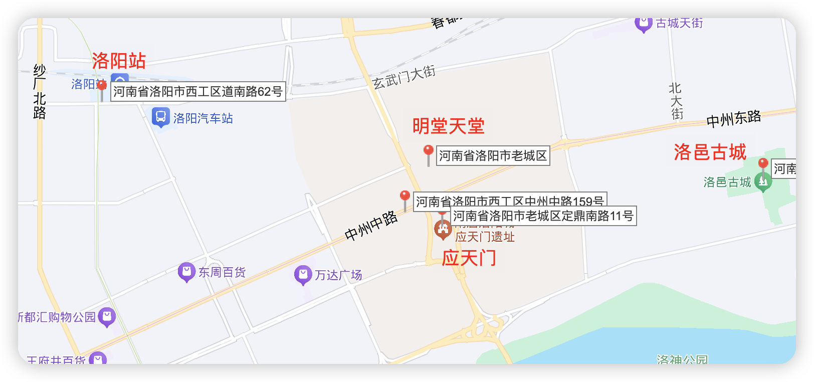
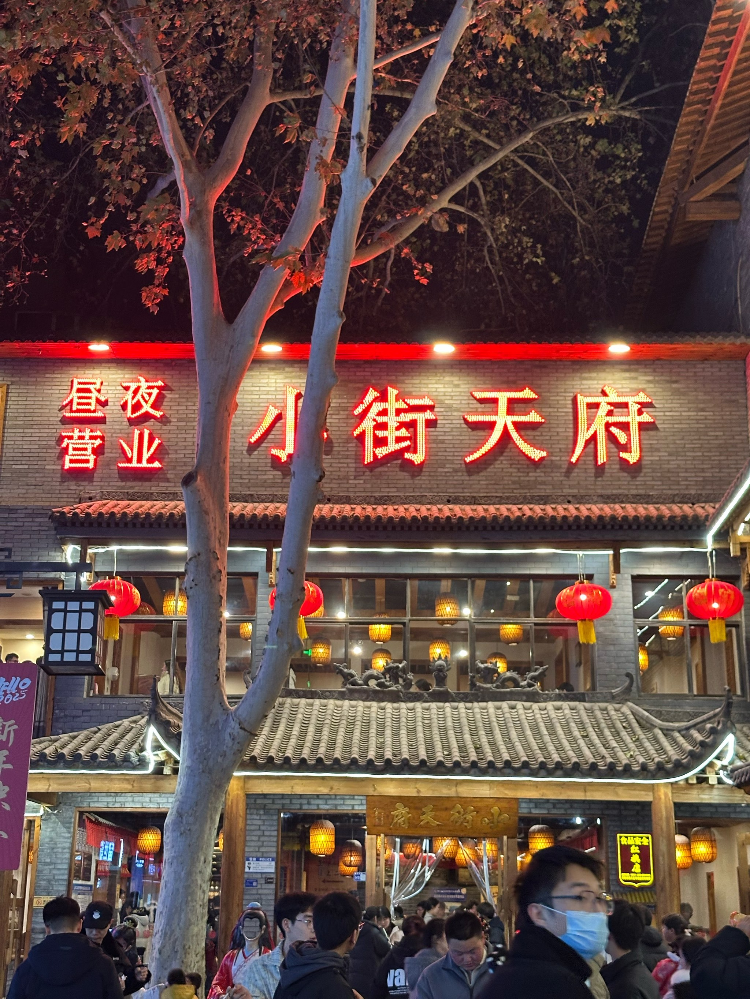
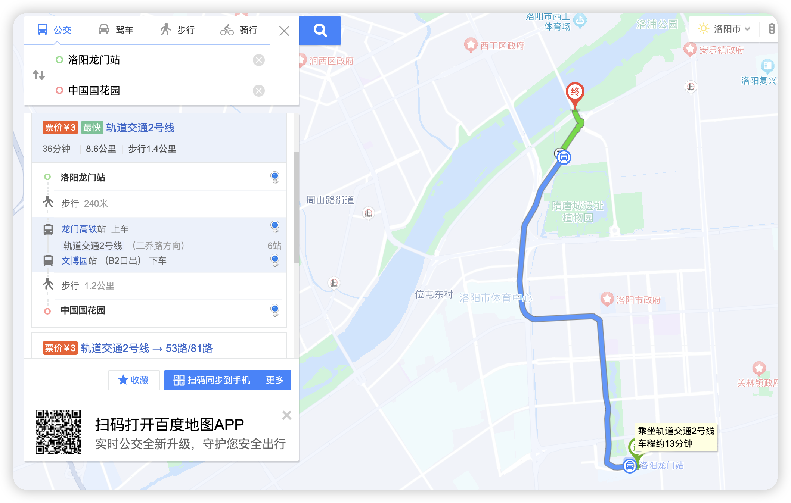

# 洛阳旅游规划

## 路线

第一天：（下午看牡丹、晚上夜市）
到龙门站后，直奔西工小街

### 西工小街（小吃街）

找到小街天府
吃完后，简单逛逛，然后去中国国花园（1-2 小时）

### 中国国花园

直奔「姚黄阁」拍牡丹

### 明堂天堂

然后晚上回到 应天门、明堂天堂、九洲池 夜市参观

### 应天门（16:00-18:30）

登应天门二楼拍天堂全景，看《唐宫夜宴》壁画。
明堂负一楼看「武则天称帝」全息投影

### 九洲池

打卡拍照

### 应天门

灯光秀（19:30-20:30）
周末加场！20:00 开始，提前占南门台阶位。

## 丽景门+十字街夜市（老城烟火）

小吃街在老城鼓楼，或者找十字街。天堂名堂在主干道中州路快到九龙鼎，也就是老城路边儿上
登丽景门俯瞰古城，十字街夜市尝水席、不翻汤，老城烟火气与历史建筑交融。

住宿可以选择丽景门、洛邑古城或应天门附近，这些地方离景区和小吃街都很近的，尤其方便晚上出去游玩洛阳夜景！

第二天：（祈福、古城游玩）
白马寺、洛邑古城

### 白马寺：祈福（8:00-10:30）

拍泰国/缅甸风格佛殿，齐云塔前喂鸽子。
在「止语茶舍」免费喝禅茶（每人限 1 杯）

- 门票 35

古迹多为元、明、清时所留，中国第一古刹

佛教传入中国后第一座由官府建造的寺院，有“中国第一古刹”之称
·白马寺现存的遗址古迹为元、明、清时所留，均列于南北向的中轴线上。
·大雄宝殿是全寺主殿，其他主要建筑有天王殿、大佛殿、毗卢阁等。
·寺内保存了大量元代夹纻干漆造像如三世佛、二天将、十八罗汉等，弥足珍贵。

### 洛邑古城

免费 4A 景区，文峰塔灯光秀与汉服旅拍完美结合，夜晚古街灯笼摇曳，NPC 式穿越体验。

### 备选： 隋唐植物园

- 隋唐城遗址植物园
  4 月看「牡丹科技馆」的太空牡丹，5 月赏芍药

## 住宿

「洛隐酒店」，步行到夜市 5 分钟

## 美食

1.牡丹燕菜馆点连汤肉片、焦炸丸，配一瓶海碧汽水。

2.白马寺附近 美食推荐「马记牛肉汤馆」，配油旋饼

3.洛阳 老城区真不同水席

4.日市，洛阳小街

5.洛阳十字街。

## 五大公园

1.中国国花园

2.隋唐遗址植物园

3.王城公园

4.西苑公园

5.牡丹公园

## 景点搁置

### 龙门石窟

- 门票直接扫码 90 ，排队 80

中国四大石窟之一，历史悠久，开凿经历了多个朝代，断续营造达 500 余年之久。
·北魏时期雕凿的众多洞窟中，以古阳洞、宾阳中洞和莲花洞、石窟寺这几个洞窟最有代表价值。
·共有 97000 余尊佛像，其中西山石窟是精华部分，包括卢舍那佛像和“龙门二十品”。
·唐代龙门石窟的重点洞窟中，以规模宏伟、气势磅礴的大卢舍那像龛群雕最为著名。

线路推荐

- 1、西山石窟：北门 → 禹王池 → 潜溪寺 → 宾阳三洞 → 摩崖三佛龛 → 万佛洞 → 莲花洞 → 奉先寺 → 古阳洞 → 药方洞 → 南门
- 2、东山石窟：南门 → 擂鼓台三洞 → 文物廊 → 千手千眼观音像龛 → 西方净土变龛 → 看经寺 → 二莲花洞 → 四雁洞 → 北门
- 3、香山寺：南步游道 → 莲花池 → 钟楼、鼓楼 → 天王殿 → 罗汉殿 → 石楼 → 九老堂 → 观景台 → 大雄宝殿 → 乾隆御碑亭 → 蒋宋别墅 → 撞钟（钟、鼓楼观景台留影）
- 4、白园：南大门进 → 南诗廊 → 琵琶峰 → 北诗廊 → 道诗书屋 → 乐天堂 → 青谷 → 正门

### 香山寺 （在龙门石窟景点内）

·蒋介石和宋美龄在这住过一阵子
·香山寺位于龙门东山山腰，始建于北魏熙平元年。武则天称帝时重修该寺。
·香山居士-白居易曾捐资六七十万贯，重修香山寺，并撰《修香山寺记》
·清康熙年间重修，乾隆皇帝曾巡幸香山寺，称颂“龙门凡十寺，第一数香山”。

<!--  -->

### 古墓博物馆

可进入真实墓室，壁画馆藏汉代至宋元珍品，地下展厅还原 25 座历代墓葬，体验“北邙山头少闲土”的震撼。

### 洛阳博物馆

- 免费
  馆藏极其丰富，还能观赏先秦时期珍品

洛阳博物馆与中原明珠电视塔等城市地标性建筑遥相呼应，新馆建筑外形如大鼎屹立，寓意“定鼎洛邑”。
·博物馆由主楼和辅楼组成，主楼共两层，一楼是通展，二楼是博物馆的精品展。
·新馆共展出文物 1.1 万余件，除了本地出土的文物外，还接受了一批故宫博物院调拨的珍品。

### 洛阳老街

- 免费

距今已有 3050 多年的历史的复古街道，是洛阳历史文化的缩影

老街文化形成于金中京，是在隋唐东都的东城旧址上兴建的，距今已有三千多年的历史。
·洛阳老街保存着原始的面貌，往来的人群，吆喝叫卖的小贩和两旁林立的商铺，处处充满了古都的味道。
·在这里可以体验到老洛阳现在的繁华场面，可以吃到洛阳当地各色美味，其中最多的便是洛阳水席。
