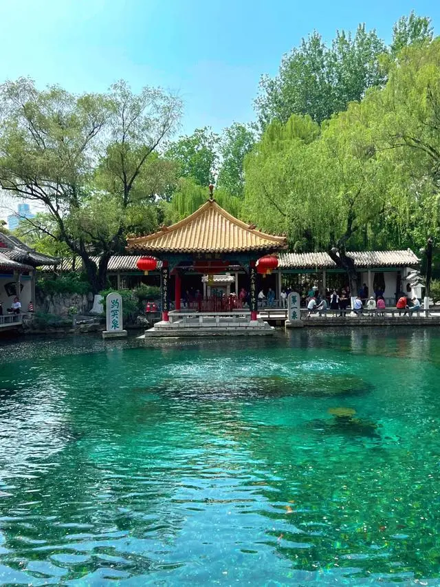
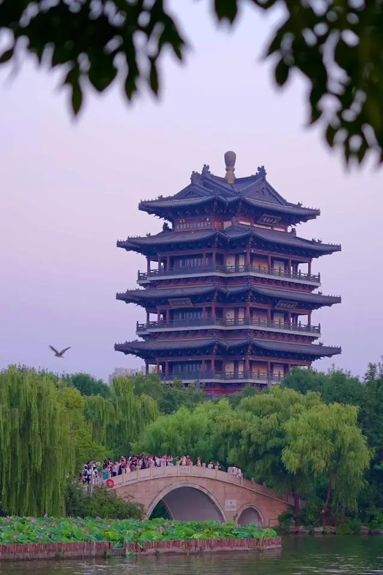
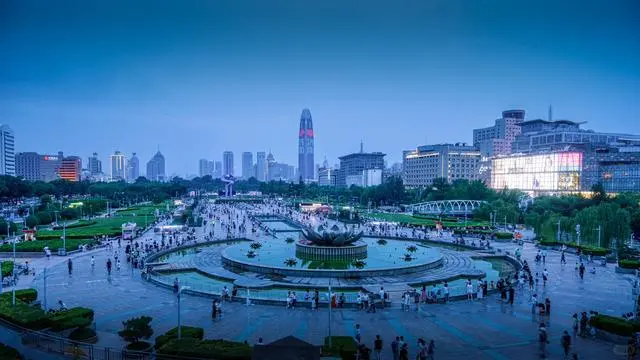
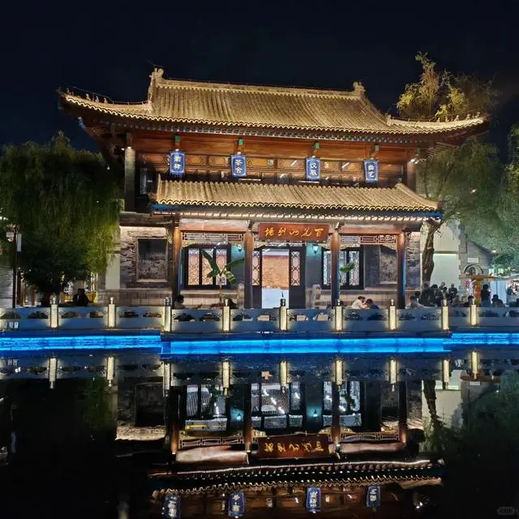
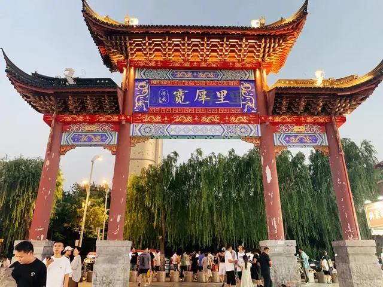

# 济南旅游

## 一、趵突泉

作为济南七十二名泉之首，趵突泉可是济南的标志性景点。泉水清澈，三股泉眼日夜喷涌，声如隐雷，景象壮观。

亮点：最吸引人的当然是那三股不断涌动的泉水了。特别是在秋冬季节，水面上蒸汽袅袅，仿佛仙境一般。

## 二、大明湖

大明湖是济南众多泉水汇流而成的一处天然湖泊。湖面宽阔，湖水清澈，四周绿树成荫。

亮点：湖上泛舟，欣赏湖边的垂柳和远处的山峦，感受那份宁静与惬意。特别是夏日的傍晚，湖风习习，十分凉爽。

## 三、泉城广场

泉城广场是济南市中心的一处大型公共广场，也是市民休闲的好去处。广场上有音乐喷泉、雕塑、绿化带等。

亮点：晚上的音乐喷泉表演是泉城广场的一大看点。随着音乐的节奏，喷泉变换着各种造型，美轮美奂。

## 四、曲水亭街

曲水亭街是济南的一条古老街道，街道两旁保留着许多古建筑和老字号店铺。

- 亮点：这里的古色古香和悠闲的氛围是曲水亭街最大的亮点。走在石板路上，仿佛穿越到了古代。

- TIPS：下午来曲水亭街逛逛，感受那份古老与悠闲。可以品尝一下街边的特色小吃，如煎饼果子、糖葫芦等。

## 五、宽厚里

宽厚里是济南的一处历史文化街区，也是美食的天堂。这里有各种小吃、餐厅、咖啡馆等。

亮点：宽厚里的建筑风格独特，既有北方的厚重，又有南方的灵秀。这里的美食也是一大亮点，各种口味应有尽有。

## 路线规划

### 第一天

上午

趵突泉：作为济南七十二名泉之首，趵突泉是必游之地。建议早上前往，以避开人流高峰。在这里，你可以欣赏到三股泉眼日夜喷涌的壮观景象，特别是在秋冬季节，水面上蒸汽袅袅，仿佛仙境一般。
中午

午餐：在趵突泉附近的餐馆享用午餐，品尝地道的济南菜，如糖醋鲤鱼、九转大肠等。
下午

大明湖：午餐后，前往大明湖。湖面宽阔，湖水清澈，四周绿树成荫。你可以选择湖上泛舟，欣赏湖边的垂柳和远处的山峦，感受那份宁静与惬意。
傍晚

泉城广场：傍晚时分，前往泉城广场。这里是济南市中心的一处大型公共广场，也是市民休闲的好去处。晚上，你可以欣赏到音乐喷泉表演，随着音乐的节奏，喷泉变换着各种造型，美轮美奂。
晚上

宽厚里：晚餐推荐在宽厚里享用。这里是济南的一处历史文化街区，也是美食的天堂。你可以品尝到各种口味的美食，如烧烤、火锅、小吃等。

### 第二天

上午

曲水亭街：早上前往曲水亭街，感受古色古香和悠闲的氛围。走在石板路上，仿佛穿越到了古代。你可以逛逛两旁的古建筑和老字号店铺，品尝一下街边的特色小吃，如煎饼果子、糖葫芦等。
中午

午餐：在曲水亭街附近的餐馆享用午餐，品尝济南的特色小吃或当地菜肴。
下午

洪家楼教堂：午餐后，前往洪家楼教堂。这是一座具有浓厚历史底蕴的教堂，建筑风格独特，值得一看。
李清照纪念馆：随后前往李清照纪念馆，了解这位著名女词人的生平与作品，感受她的才情与魅力。
傍晚

千佛山：如果时间允许，可以前往千佛山。这里不仅有美丽的自然风光，还有丰富的历史文化遗迹。你可以爬山锻炼身体，也可以参观寺庙和院落，感受佛教文化的深厚底蕴。
晚上

灵岩寺：如果时间充裕且对佛教文化感兴趣，可以前往灵岩寺。这是济南的一处著名佛教圣地，有着悠久的历史和深厚的文化底蕴。
