# 西安三天两晚旅游攻略

G91高铁12:06到达

## 第一天

---
### 陕西西安博物馆
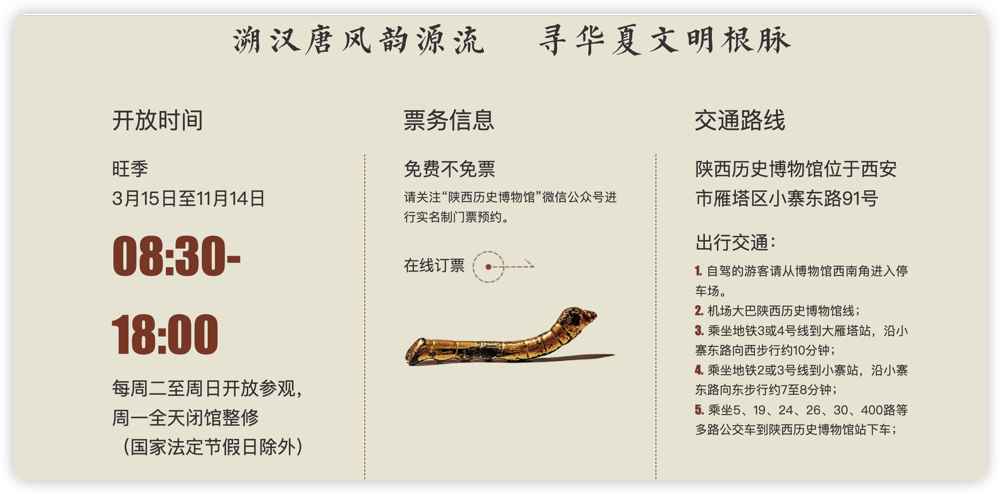
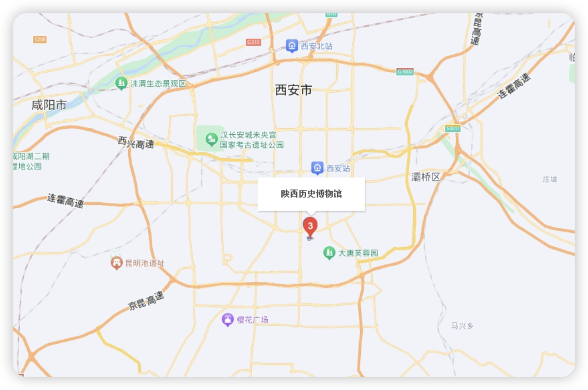

---
### 西安城墙

游玩时长：4小时
日落时分景色最佳
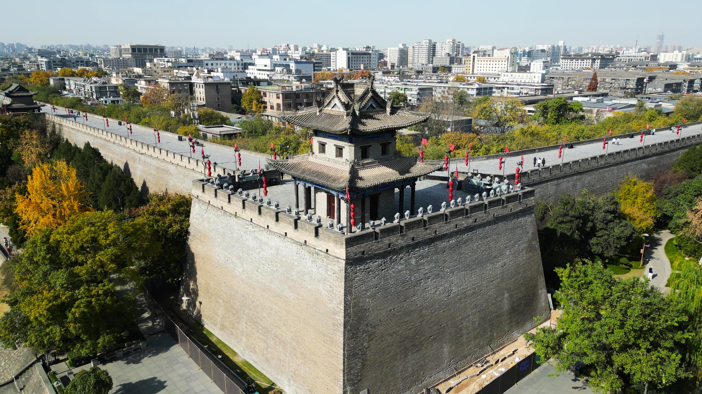
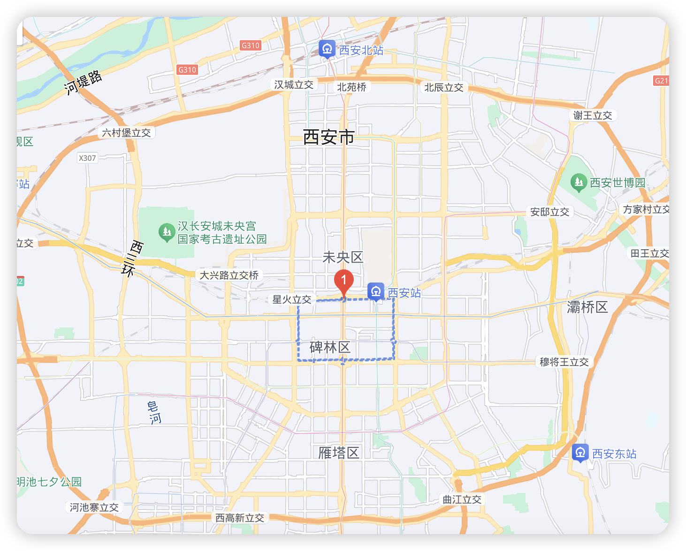

---
### 大雁塔

大雁塔开放时间 8:00-18:00
大雁塔音乐喷泉 20:30
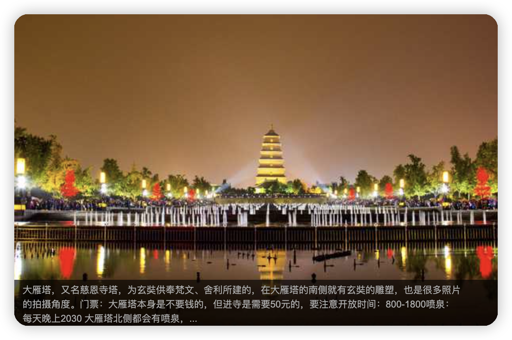

---
### 大唐不夜城

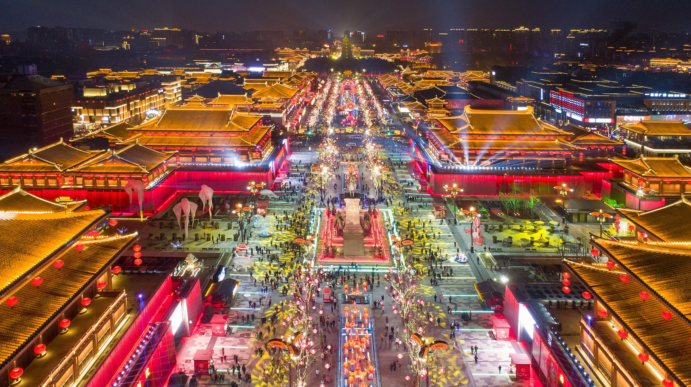
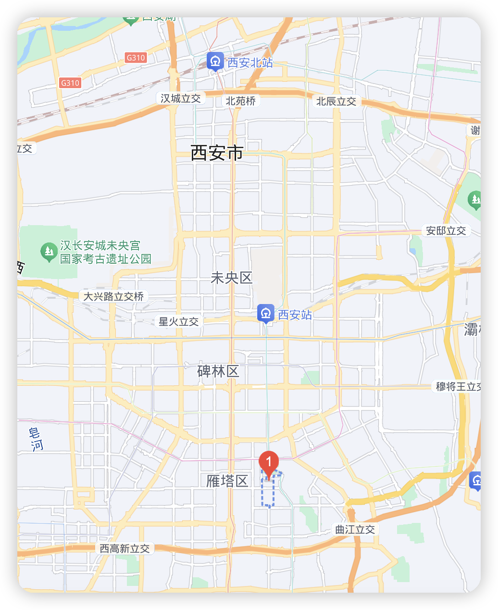
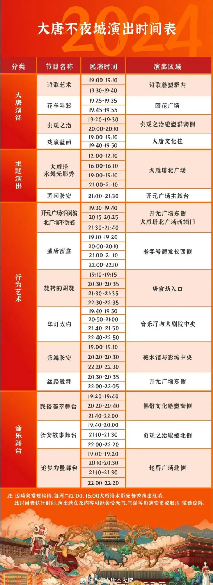

* 观演攻略

  1、大唐不夜城的演出不用预约全部免费。

  2、从大雁塔北广场出发，可以先看晚上19:00的喷泉表演，声光水电的融合，还是亚洲第一大音乐氛围喷泉，一场十分钟。

  3、自北向南开始游览，穿过大雁塔步行街，行进500米，可以看到今年火遍朋友圈的诗词街，诗词挂满树枝，伴着星光点点，享受一份独特的长安诗词浪漫。

  4、走完步行街，800米长的大雁塔广场就算走完了，就可以看到距今约1300年的大雁塔，还有唐玄奘塑像，马路对面就是大唐不夜城的北入口。

  5、大唐不夜城从晚上19:00开始一共有22场演出，每场十分钟，都是免费‼️但是一路走到终点不可能全部看完，建议折返回地铁站时可以路上捡漏看几个。

 推荐几个必打卡的演出

  《盛唐密盒》两位唐代装束的表演者吟诗作对，会随机挑选路人上台对诗两句。

  《花车斗彩》西域胡姬与大唐美女现场舞蹈。

  《贞观之治》李世民穿越现代，一展盛唐景象。

  《再回长安》是场地最大、演员最多、时间最长的表演。讲述千年前大诗人白居易回到长安，大家用美酒迎接他的场景。‼️强推这个表演，时间一定记清楚。

  《唐装不倒翁》在大唐不夜城的终点开元广场东侧观看。

## 第二天

---
### 钟鼓楼

---
### 永兴坊

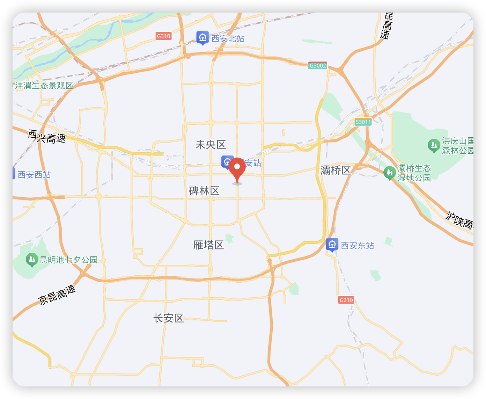
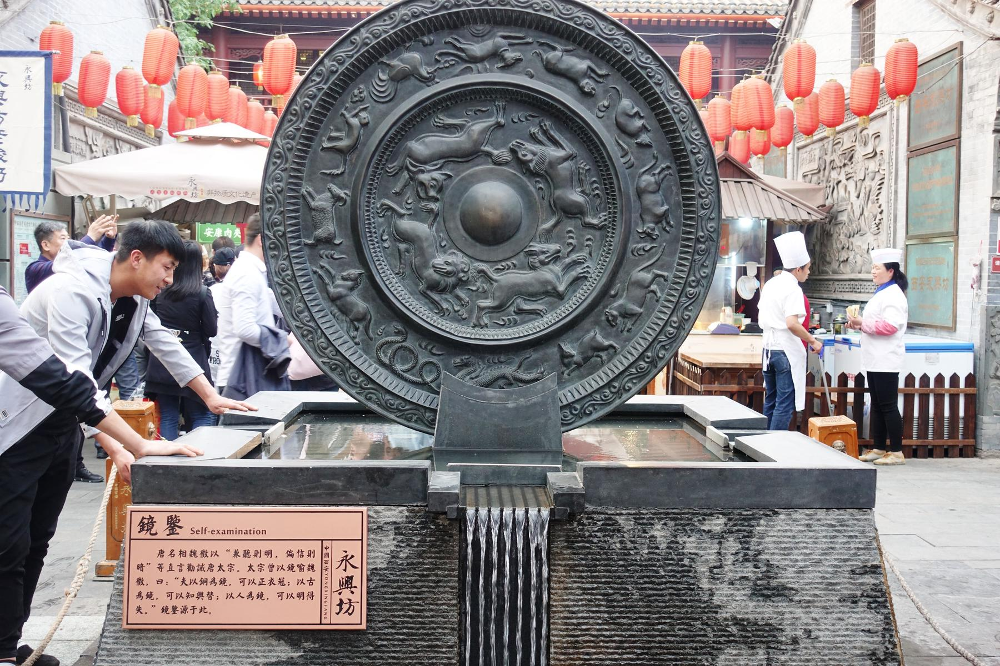
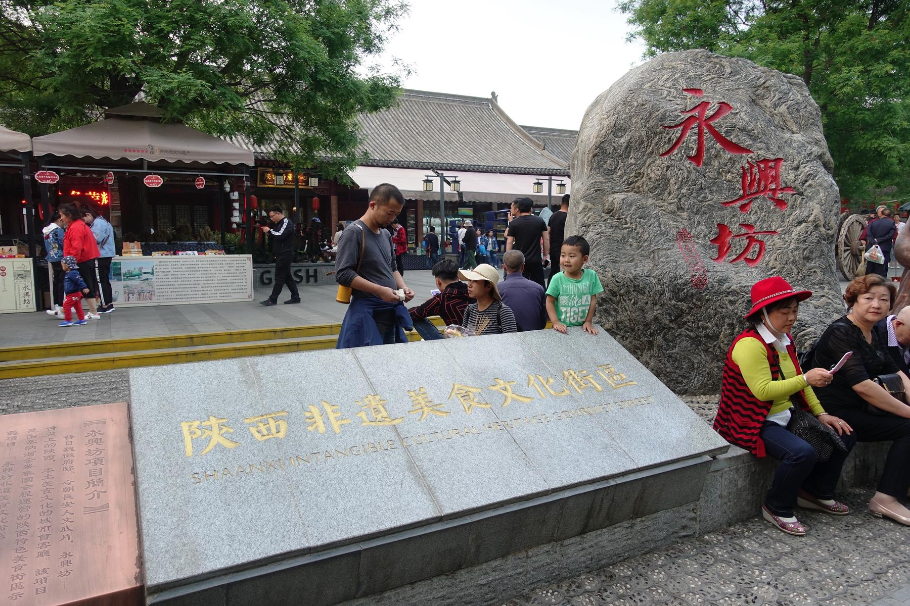

---
### 大唐芙蓉园
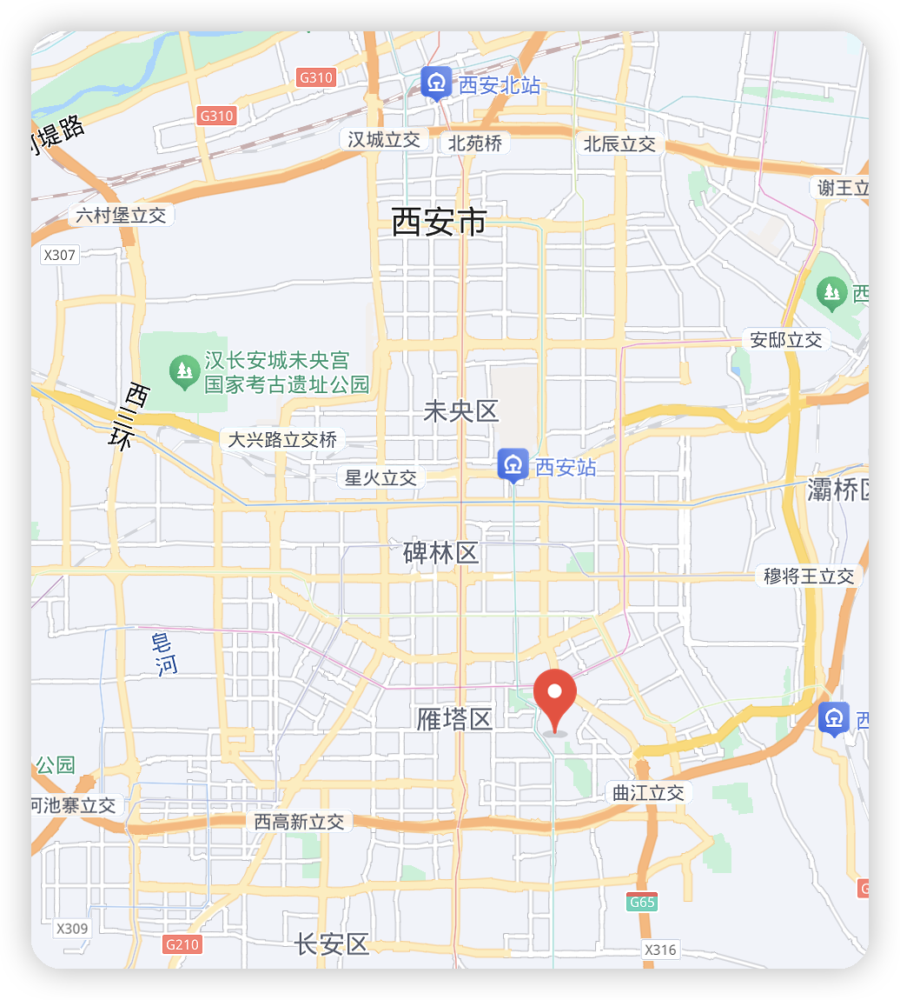

## 第三天

上午：前往华清宫，参观皇家遗址，欣赏自然风光 或者参观兵马俑
中午：在华清宫附近用餐
下午：如果时间允许: 可以前往骊山游览

---
### 华清宫
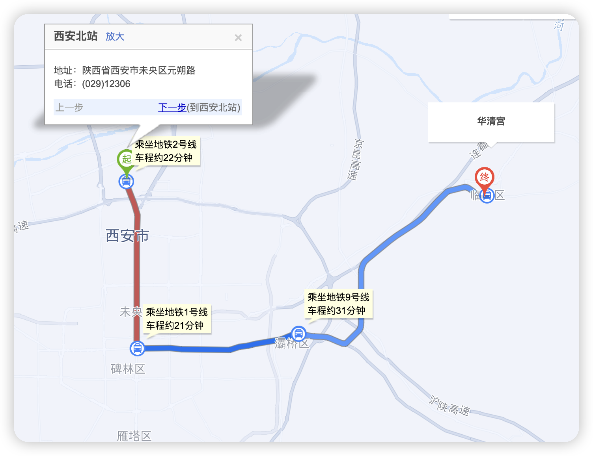

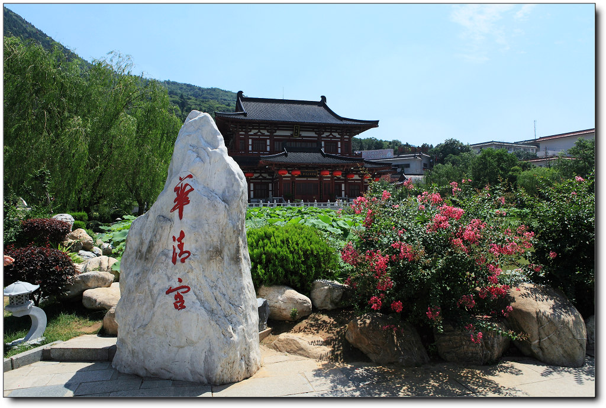
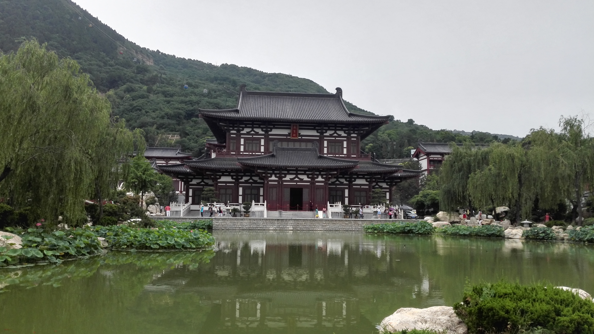

---
### 兵马俑
<Video src="/videos/兵马俑.mp4" controls />

