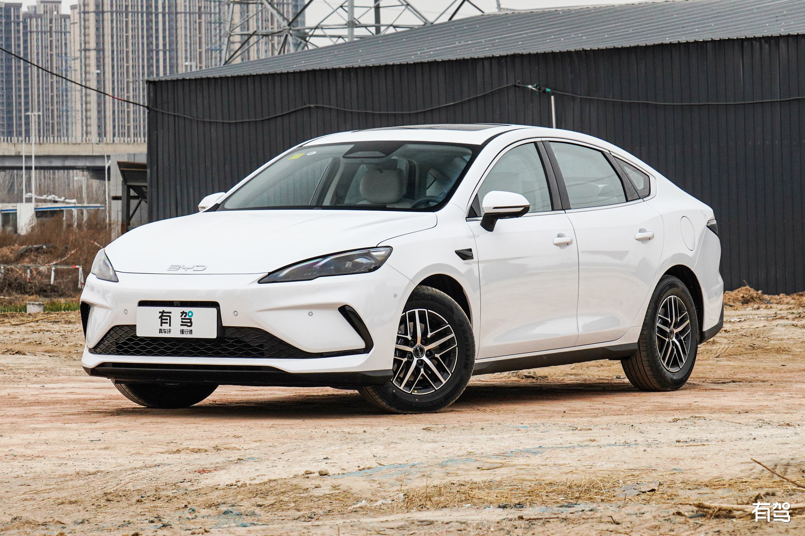

# 买车记录

最近家里需要一辆车，一直在看车。
预算不高，家用就行。
最初列的车型有很多，但我们都不太懂车。所以就一边网上了解，一边实体店看车。
2025.5.1 回老家时，我们去县城看了 大众朗逸 2025 款，觉得性价比还算不错。我们觉得是比较中规中矩的。没啥特点、也没啥优点。

我借了我老表的朗逸看了两天办事。
家里人说，五一之后就买。
我还考虑着六七月之间再买的，因为车价在这两个月最便宜。
五一之后，利用周末时间跑了几趟4S店，看了几家车企，最后选择了比亚迪。
之前还总说买比亚迪看着low，没想到最终居然买了比亚迪 😂

当时看的比亚迪驱逐舰05，犹犹豫豫决定买这款时，4S店打电话说这款不生产了。

销售又推荐了比亚迪海豹05 dm-i，说是和驱逐舰一样的配置，就是换个壳而已。对比了海豹05和06，06有智驾但价格贵了不少。
目前智驾还不太成熟，我们两个新手司机对这个也不太感兴趣。
所以就定了海豹05 dm-i，落地价在预算内。

看完之后的第二个星期，家里人就帮我把车订了，想给我个惊喜。瞒了我一个星期，一个字都没透露。

直到我回去的时候才知道 😂 挺开心的～
