# 周末练车：帕萨特

# 费用

租车平台：一嗨租车
租车时间：2025 年 2 月 15 日 - 2 月 16 日
租车费用：385
油费：开了两天，油费 153
高速费：28.5

# 开帕萨特去练车

这个周末，我决定挑战自我，作为一名新手司机，我计划租一辆车，从北京回龙观出发的自驾游，准备开始我的自驾游之旅。

早上，阳光正好，我满怀期待地从回龙观出发。我的第一站是军都山滑雪场，虽然这个季节不能滑雪，但滑雪场周边的风景依然让我流连忘返。这段路程主要是城市道路和高速路，路况较好，我保持着适中的车速，时刻注意着路况和交通信号，感觉非常顺畅。

离开滑雪场后，沿着山路前行，前往居庸关。山路开始增多，我小心翼翼地驾驶着，时刻注意着弯道和坡道，确保安全通过。居庸关的险要地形让我惊叹不已，我停下车来，拍下了这张难忘的照片。站在居庸关上，我仿佛能听到历史的回音，感受到那份厚重的历史底蕴。

接着，我继续前行，前往八达岭。这段山路更加崎岖，但沿途的风景也更加壮丽。我不断调整着车速和方向盘，以适应山路的起伏和转弯。当我站在八达岭长城上，俯瞰着脚下的群山和远处的城市，那种成就感油然而生。我深深地吸了一口气，感受着这份来自大自然的馈赠。

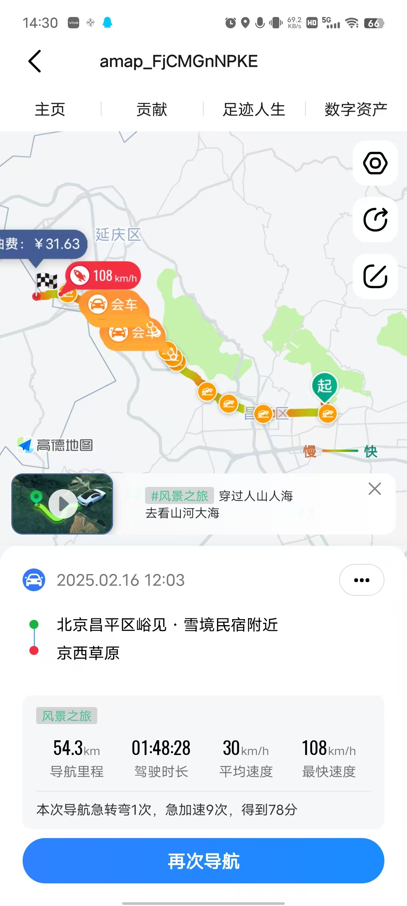

离开八达岭后，我驶向了京西草原。这段路程较长，但路况较好，可以享受安逸的驾驶体验。

## 到达京西草原

<Video src="./img/2025021701.mp4" controls></Video>

## 回来的路线

在片刻停留之后，我踏上了归途。回来的路线，我选择的是高速路线，想检验下自己的驾驶技能。虽然高速路况较好，但我也时刻保持警惕，遵守交通规则，确保安全驾驶。当然也免不了想提升下速度，最高时速达到了 133km/h，这是我开车以来的最高时速了。但应该也只此一次，以后断然不会开那么快了。当我顺利回到市区时，我感到无比的轻松和满足。
本次高速，是我练车以来的最高速度，高达 133km/h （是确保的绝对安全情况下跑出来的）
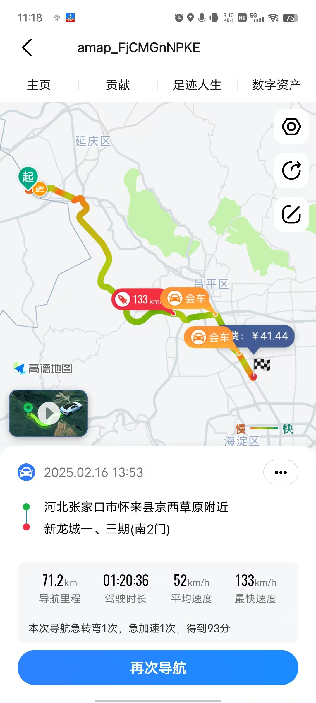

这次自驾游对我来说是一次难忘的经历。让我开车越来越有自信，又欣赏到了北京周边的美丽风景。在驾驶过程中，我深刻体会到了安全驾驶的重要性，也学会了如何调整自己的心态和情绪。我相信在以后，我会可以更勇敢地开的更远，去探索更多美丽又让人向往的风景。

## 拍照

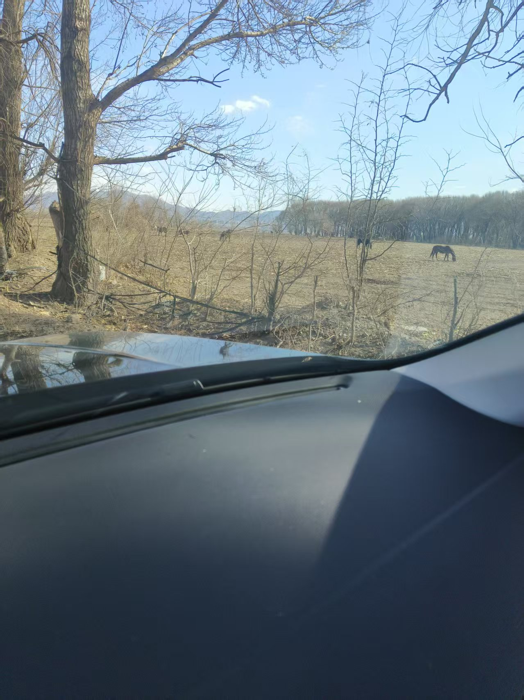

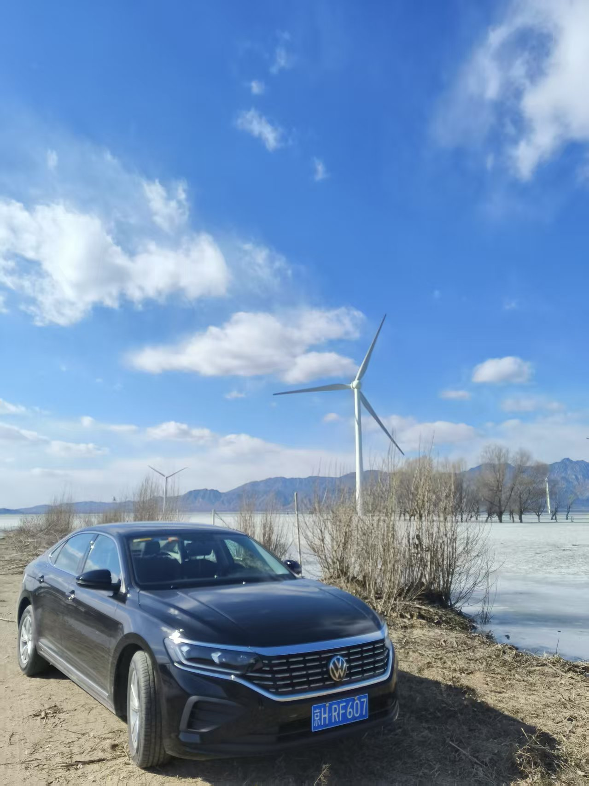

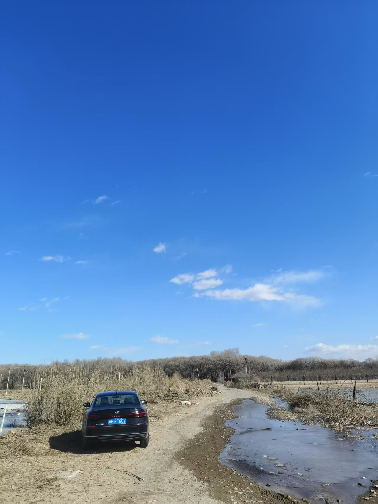

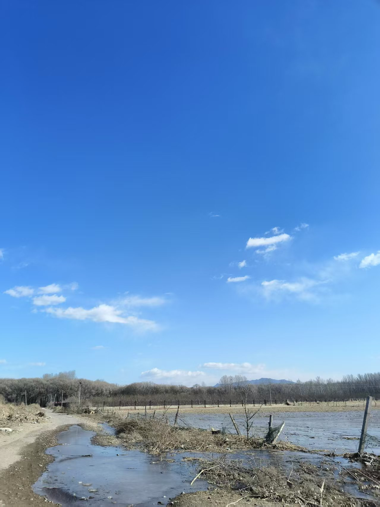

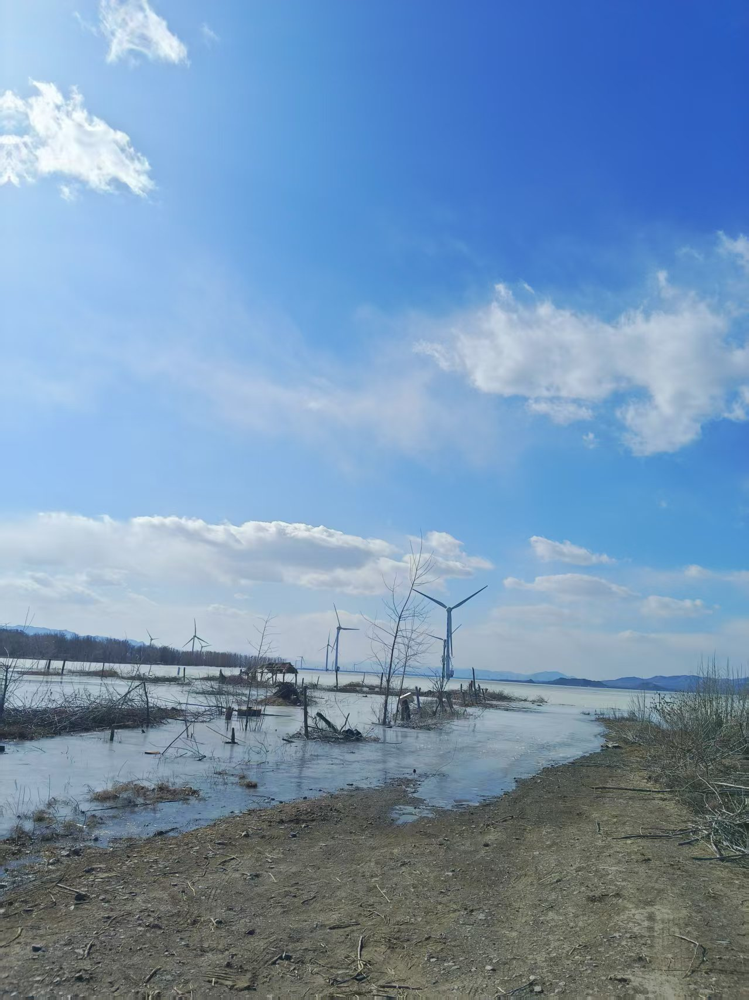

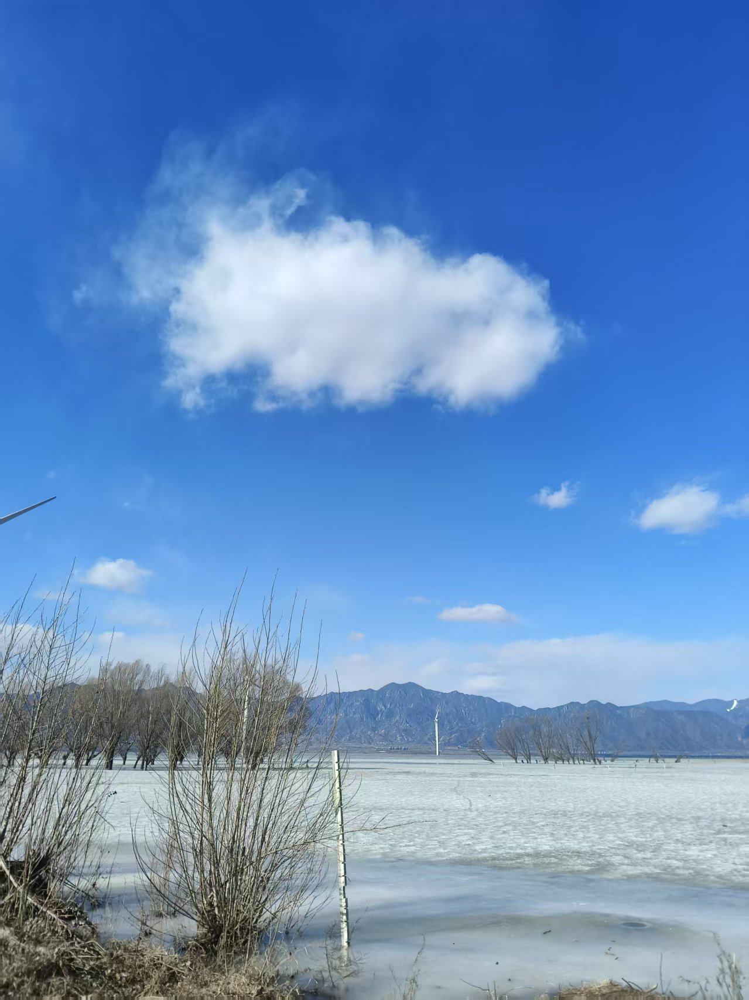

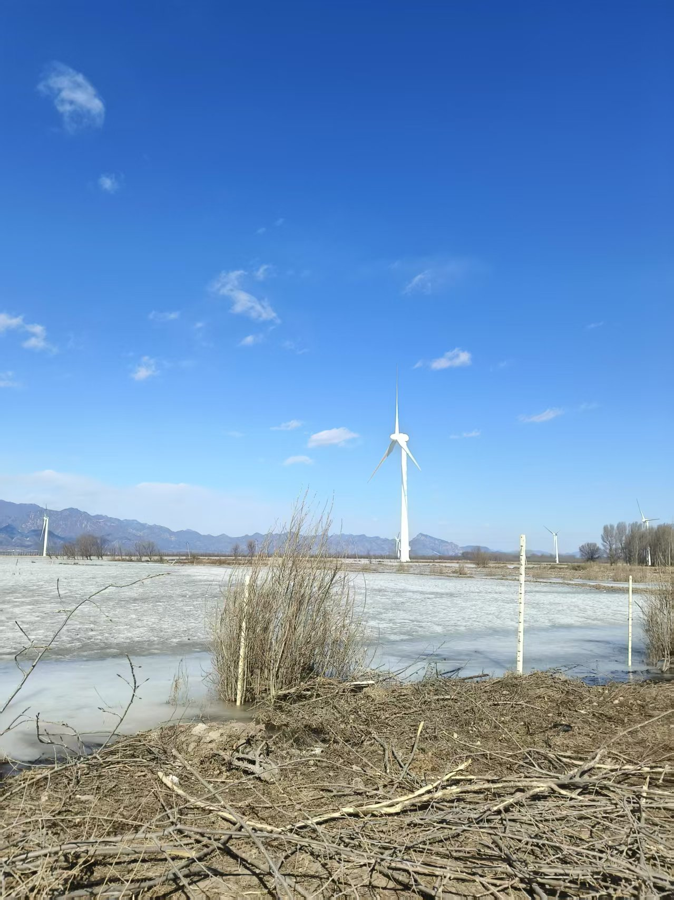

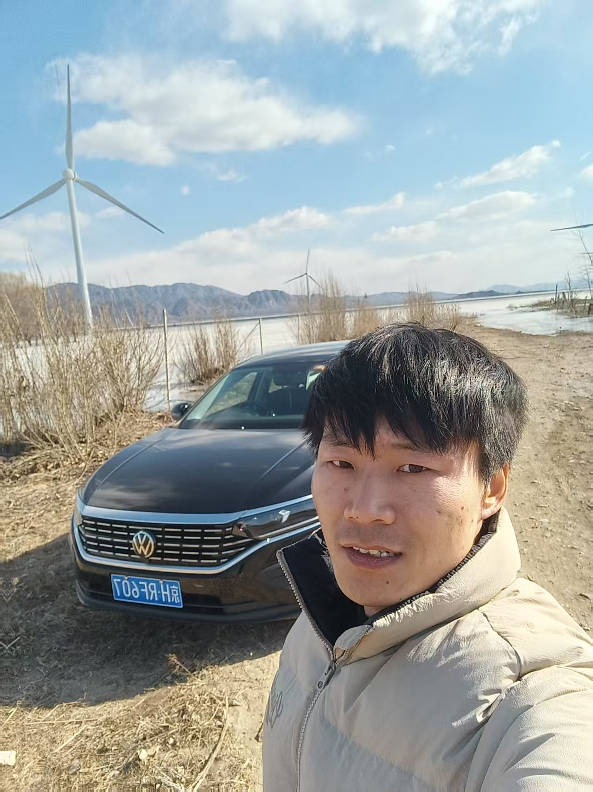

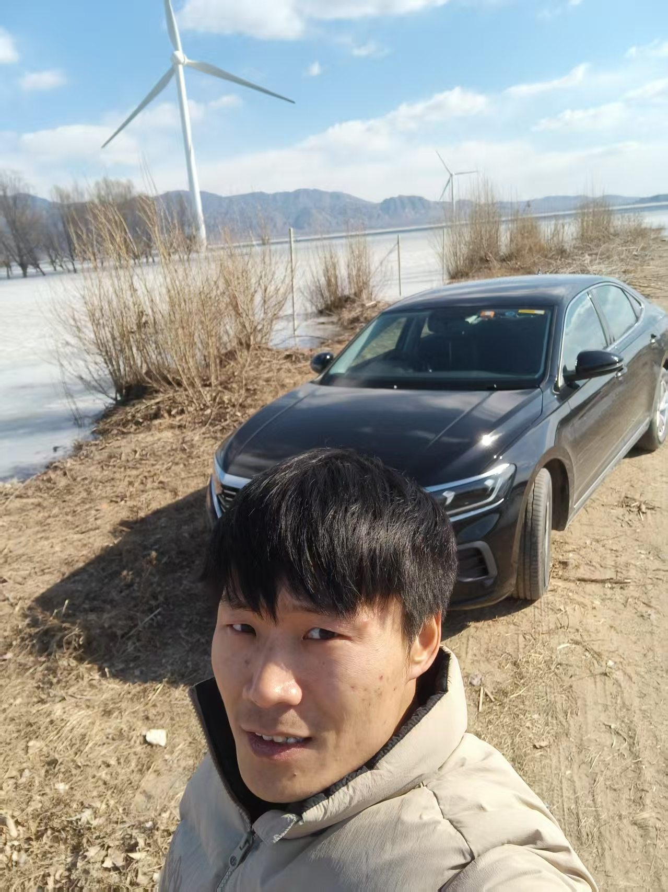
