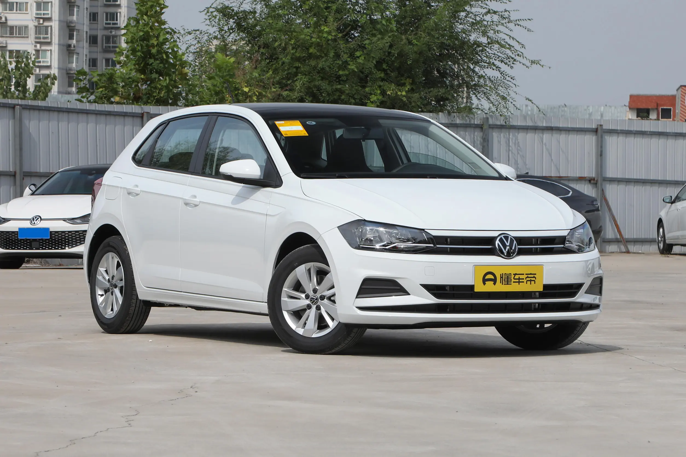
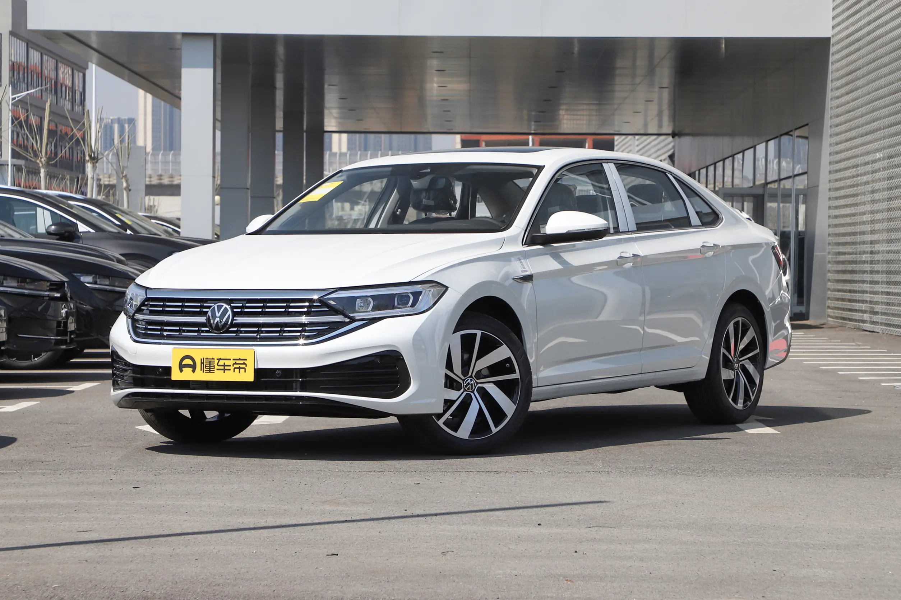
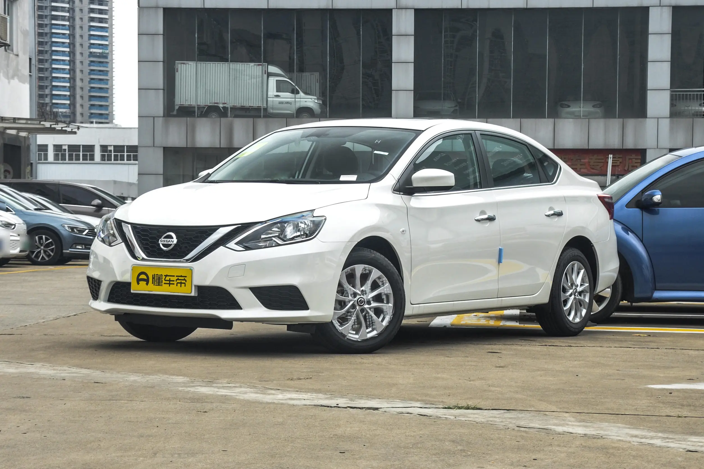
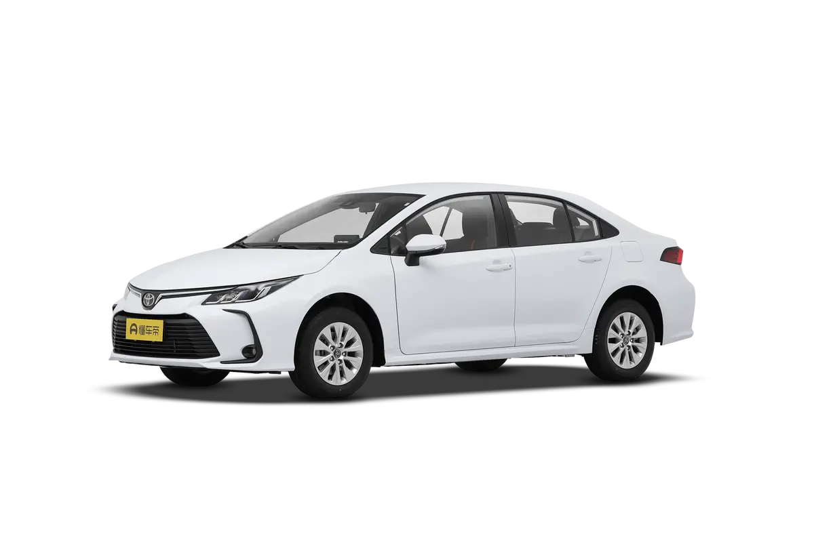
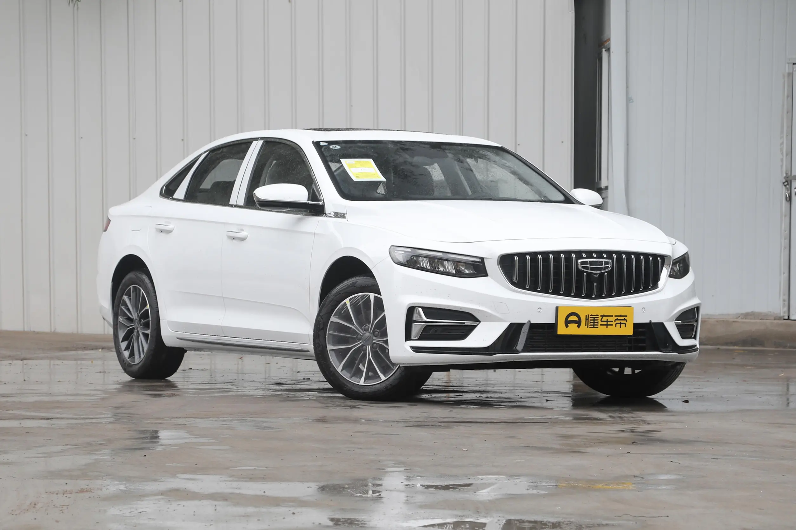
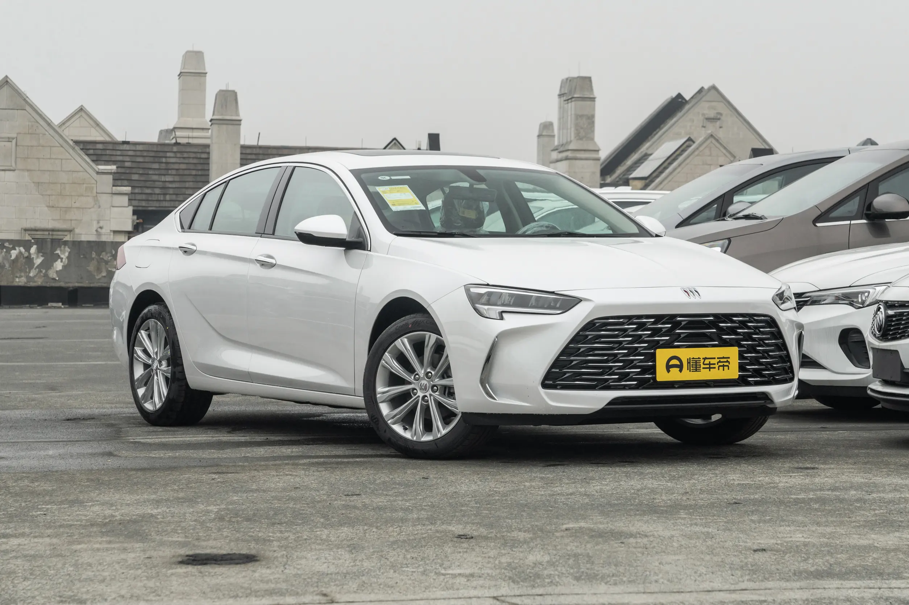
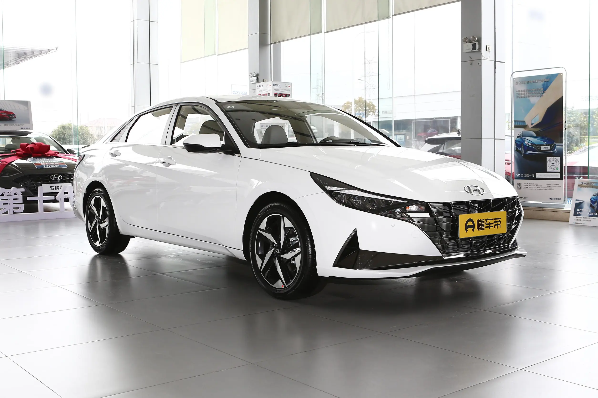

# 购车方案

家用车可分为 a 级车、b 级车，a 级车是紧凑型，b 级车是舒适型。

## 大众-polo

[传送](https://www.dongchedi.com/auto/series/391)

和海鸥大小一样



## 大众- 速腾

[传送](https://www.dongchedi.com/auto/series/414)

侯玉杰买的就是这个，目前跑了 10 万公里，也没啥故障



## 日产-轩逸

[传送](https://www.dongchedi.com/auto/series/1145)

朱新安买的就是这个，因动力差被称为“公路三大妈”之一，其他两款车是 丰田雷凌、丰田卡罗拉，但日常也不需要太多动力





## 丰田-卡罗拉

[传送](https://www.dongchedi.com/auto/series/542)

比较常见的出租车之一，油耗低，大概一百公里 5-6 个油左右


## 吉利-星瑞

[传送](https://www.dongchedi.com/auto/series/3476)



## 别克-君威

[传送](https://www.dongchedi.com/auto/series/348)

目前网上推的比较多，10 万的 b 级车





## 现代-伊兰特

[传送](https://www.dongchedi.com/auto/series/1310)




