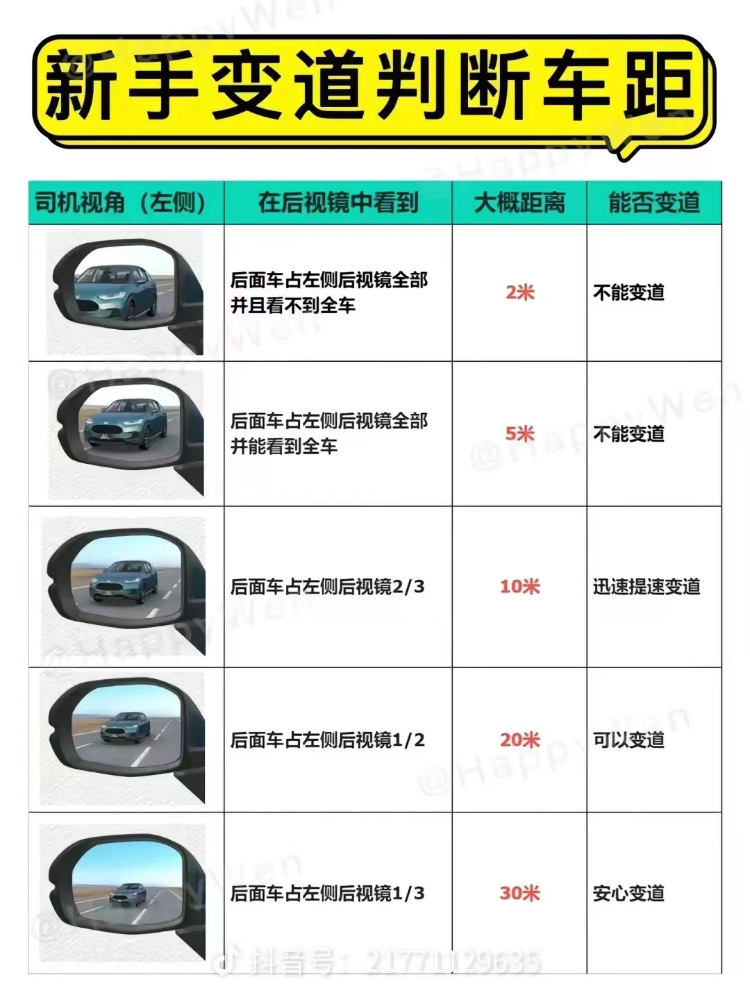
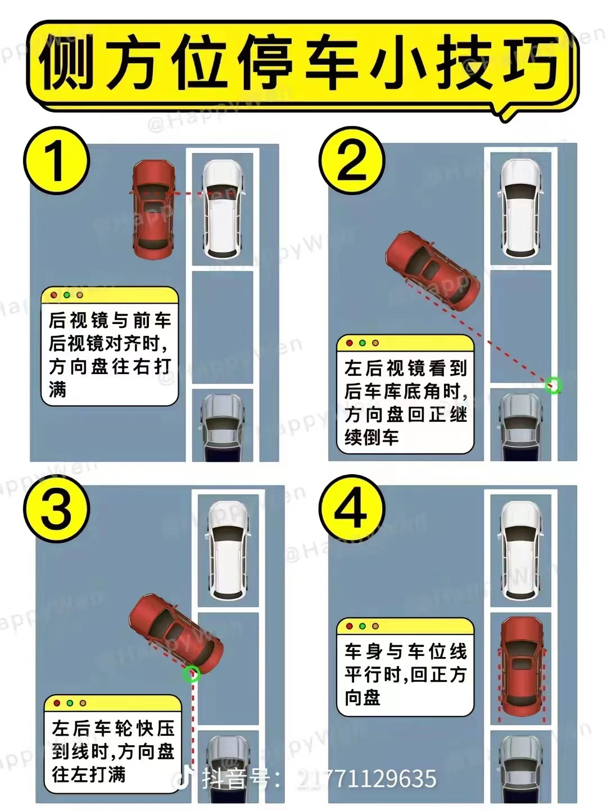
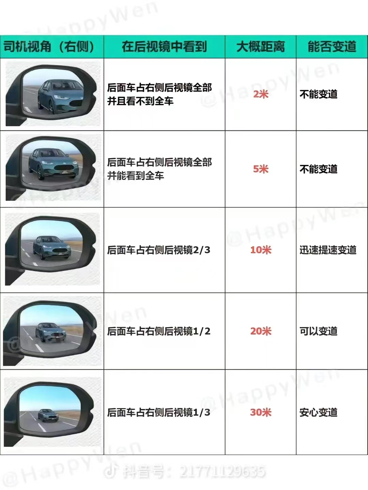
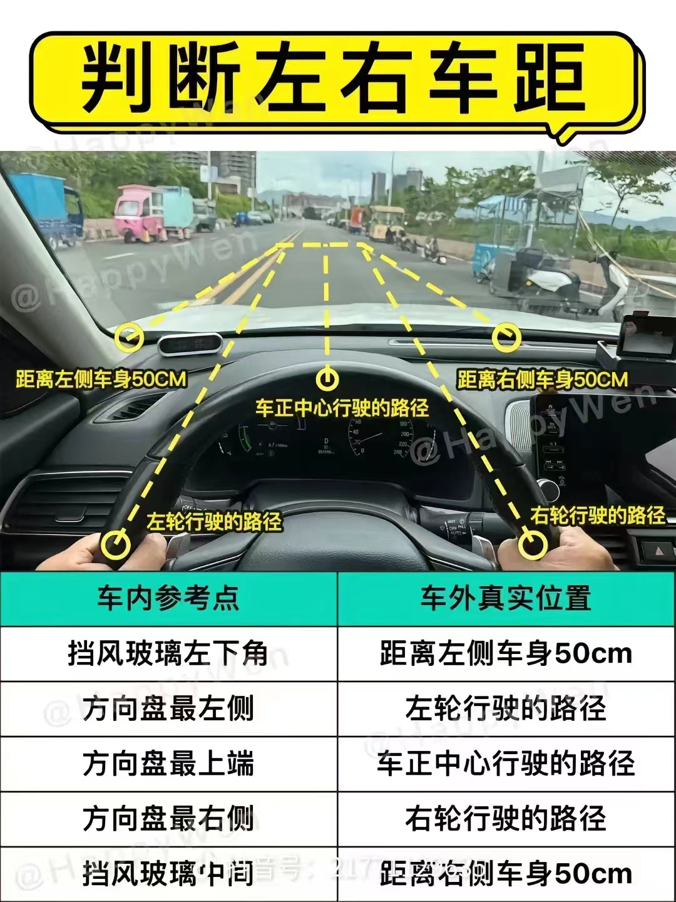
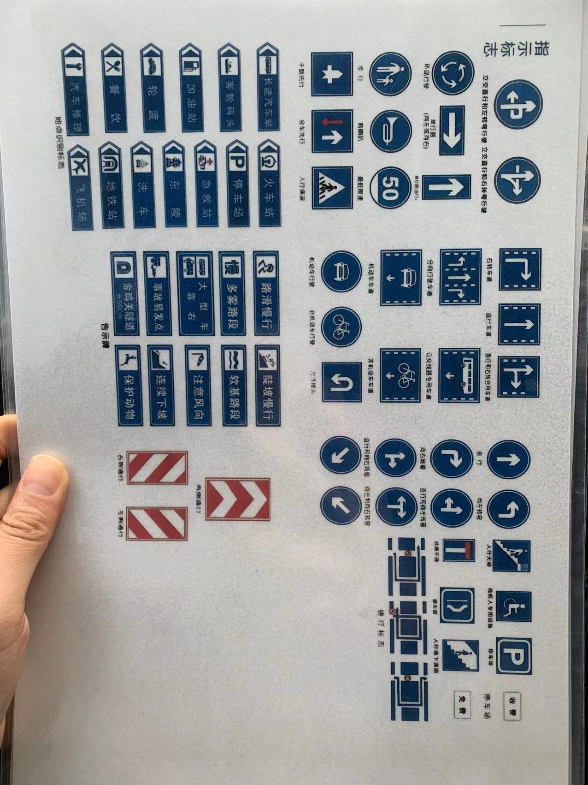
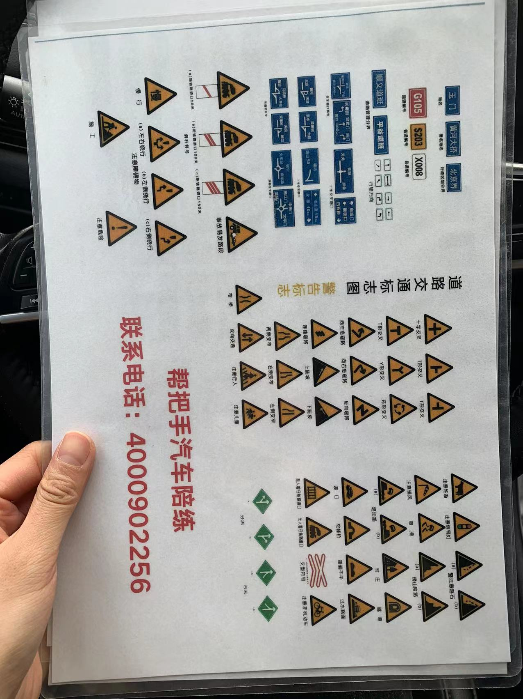

# 驾车技巧

作为一个新手司机，我在网上收集了一些实用的驾车技巧图片，放在这里随时温习。这些技巧涵盖了日常驾驶中容易忽略的细节，熟记之后对安全驾驶很有帮助。

## 跟车距离

城区跟车保持2-3秒的行车间距，高速至少4秒。遇到雨雪天气、夜间行车要再翻倍。

## 后视镜与盲区

后视镜要调到位：左右后视镜中，车身占镜面约1/4，地平线在镜面中间。但即便如此仍有盲区，变道前一定要回头看一眼。

## 停车技巧

侧方停车和倒车入库是新手最头疼的。记住参考点：侧方停车时，后轮与路沿平行时开始打方向；倒车入库看后视镜中车身与库线的距离。

## 其他要点

隧道内要开灯、跟车不要开远光、高速上不要长时间占超车道、匝道入主路要加速到匹配车速。这些看似基础，但真正做到位的司机其实不多。

> 以上图片来源于网络，整理自个人学车期间的资料收集。
