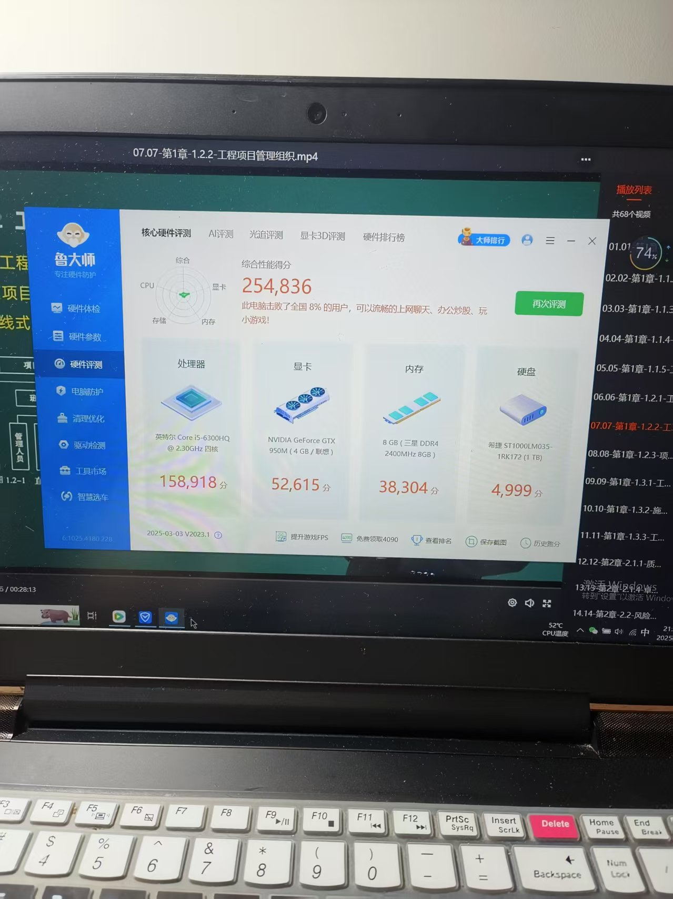
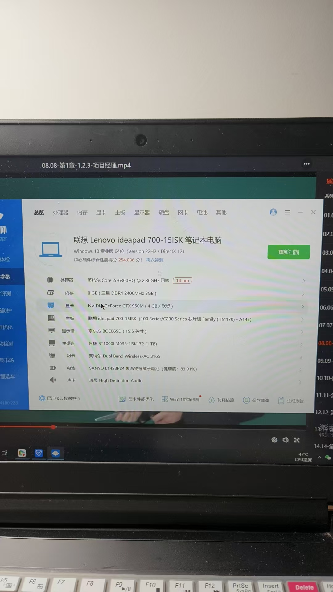

# 老婆的电脑升级记

老婆用的是一台2016年购入的联想IdeaPad 700-15ISK，掐指一算已经服役快九年了。虽然平时主要用来办公和追剧，但开机速度越来越慢，打开个WPS都要转半天圈，实在忍不了了。

## 看看这台老伙计

这台电脑的配置其实还行：i5-6300HQ处理器、GTX 950M显卡、8GB DDR4内存。主要瓶颈在硬盘——原装的1TB机械硬盘，5400转，开机40秒起步。

## 升级方案

研究了几天，决定分两步走：

**先换固态硬盘。** M.2接口支持NVMe协议，买了一块西部数据SN570 500GB当系统盘，原机械硬盘留着存文件。淘宝上花了250块。换完之后开机8秒，质的飞跃。

**再加根内存条。** 原装是单条8GB DDR4 2133MHz，从闲鱼淘了根同规格的金士顿8GB，凑成双通道16GB。花了不到100块。

## 升级感受

一共花了不到400块钱，老电脑像换了台新的。开机快、软件秒开、多开几个网页也不卡了。老婆用了之后问我："你是不是给换了个新电脑？"

如果你手里也有这种老笔记本，先别急着扔。花几百块换个固态、加根内存，老伙计还能再战三年。拆机之前记得拔掉电源、做好防静电，其他的跟着B站教程走就行。

> 本文的硬盘和内存型号推荐信息由AI辅助整理，个人升级体验为真实记录。
