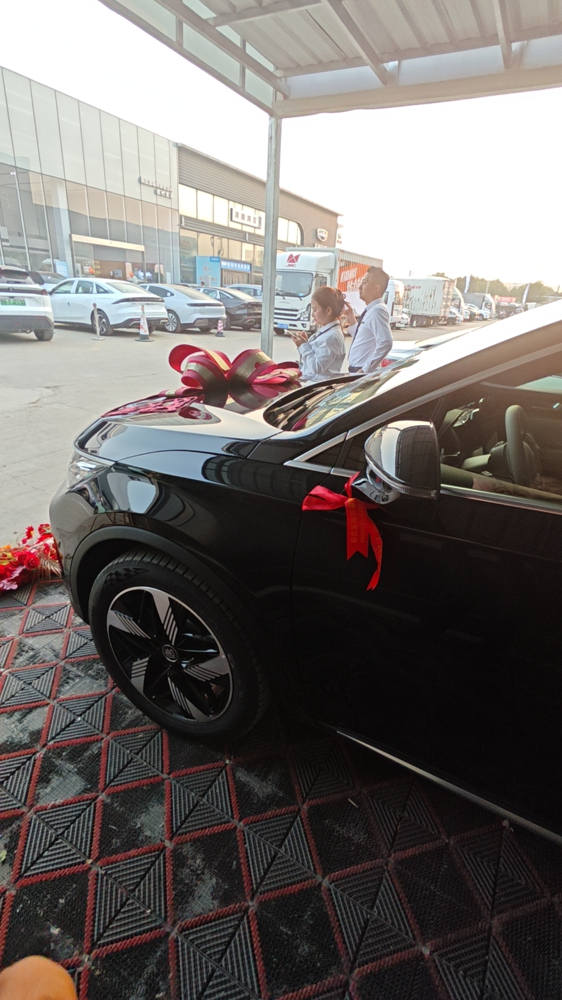
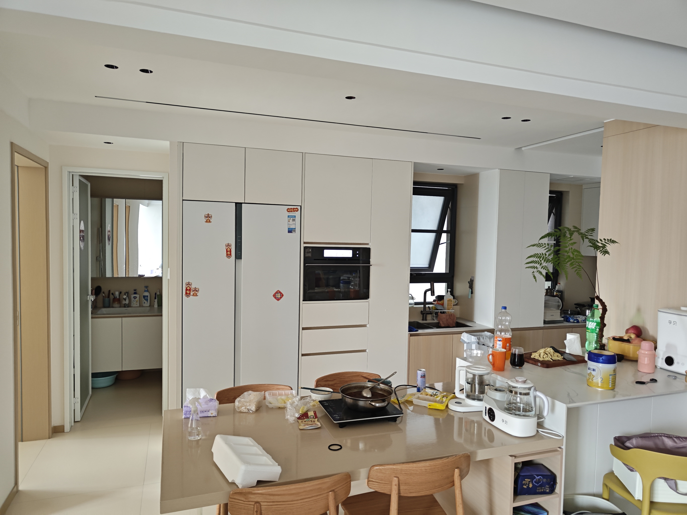

# 让我抱怨一次

为什么说是不好的感想呢，因为确实最近感想确实很不好
主要从几个事情有感而发。10.1 假期之前，我是很幻想买个车的，连续从网上看了很多车型，也开始愈发期待不久后有属于自己的车。可现实中有些事情，确实打败了我。让我不得不放弃一些规划，人生啊，真是加冰少糖。
看着别人买的车，心里羡慕不已，暗自下决心，早点处理完琐事 定居下来。在外漂泊多年，已经让我面目全非、满目疮痍了。我需要调整下，去过新的生活。

【朋友的车】

【朋友的房】

入社会后，租房久了，就会特别想要有个属于自己的房，所以后来买了房，成了房奴。
身边人都有房有车了，听到的谈话都是什么油价、车价、百公里、闯红灯之类的话题，所以就有了买车的打算。可以说是刚需，也可以说是自己给自己上了枷锁。 有时候跳出局限思维思考下，就会发现，这个社会，是资本的手在推着你走。社会的轮子都是资本家投资的。独善其身只能存在于寺庙之内。

我从小就爱以动物的眼睛看人类，可能是蚂蚁 🐜、狗 🐶、猫 🐱、鸟又或者是鱼，常常觉得没有记忆或者没有思考的动物，未必不是好事。
我也爱看空气中的微分子，虽然看不到什么，但我总觉得我能看到空气中的流动。
而长大后，现在为了碎银几两，不得不低下头来，哪怕为了区区几十块钱 也要喊一句：老板。

人生无处安放灵魂，世间也并非都有情。

鼓励对我而言已经没有了价值。末了，说句鼓励的话给面前的你，牢骚发完，就整装待发～

Fighting，Man!
