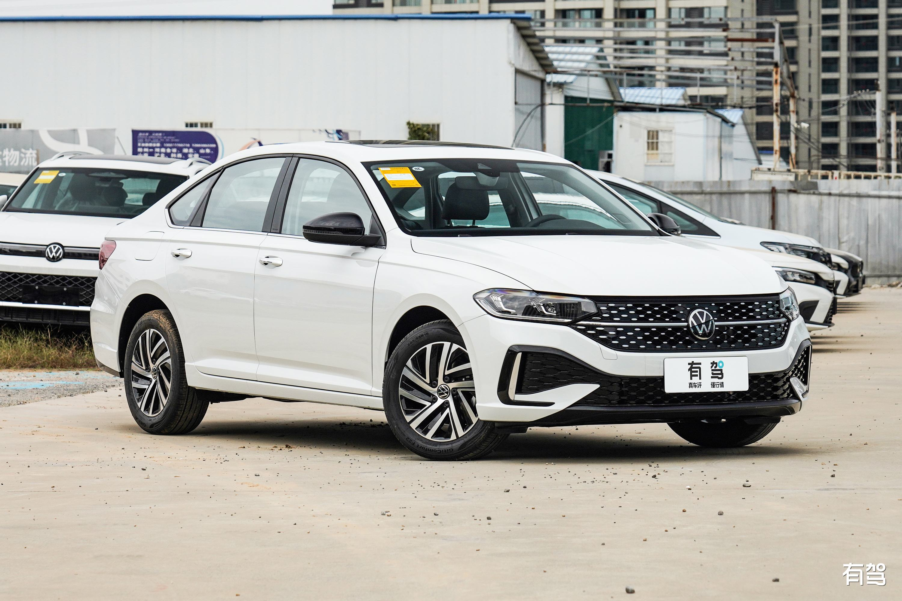
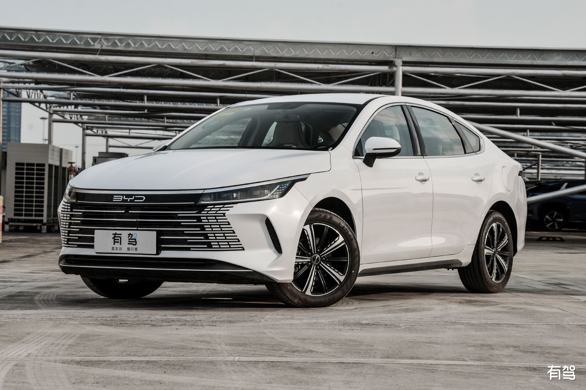

# 买车记录

眼瞅着马上要结婚了，我和我对象两人最近一直在看车。
预算不高，10 个左右的家用就行。
然后我最初列的车型有很多，但我们两人都不太懂车。所以就一边网上了解，一边实体店看车。
2025.5.1 回老家时，我们去县城看了 大众朗逸 2025 款，觉得性价比还算不错。我们觉得是比较中规中矩的。没啥特点、也没啥优点。

我借了我老表的朗逸看了两天办事。
我媳妇儿说，5.1 回郑州就买辆。
我还考虑着 6、7 月份之间再买的。因为车价在这两个月最便宜。
5.1 之后，她利用周末时间，跑了几趟 4s 店，看了几家车企 ，最后选择了比亚迪。
我们之前还总说，买比亚迪的车看着都 low，没想到我们最终居然买了比亚迪 😂

比亚迪当时她看的比亚迪驱逐舰 05，最终犹犹豫豫的决定了买这款时，4s 店打电话说这款车不生产了。
全郑州也就一家有这款了。

销售又给我们推荐了比亚迪海豹 05dm-i , 说是和驱逐舰一样的配置，就是换个壳而已。我们又开始选择海豹，当时看的海豹 05dm-i 7 万多和海豹 06 dm-i，但 06 的价格低配是 9 万左右，高配 12 万左右。
我们觉得两款车，外观、内饰、动力基本都一样，只是 05 基础款没有智驾。06 有。
但目前智驾还不太成熟，我们两个新手司机，对这个也不太感兴趣。
所以就定了车型 海豹 05dm-i。
性价比很高，落地 7.3

应该是看完之后的第二个星期，我对象就订车了。订车这事没有给我说，是想给我个惊喜。她可真能忍，😂 订车一个星期，都没给我透露一个字。

直到我回到郑州时，给我了个惊喜 😂 我欢喜的抱着她。
开心～
