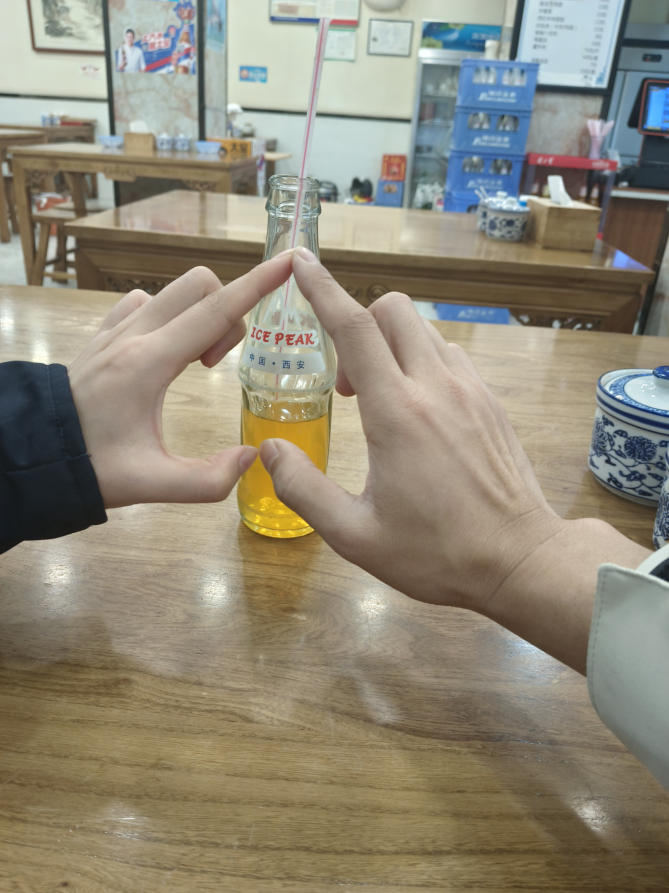
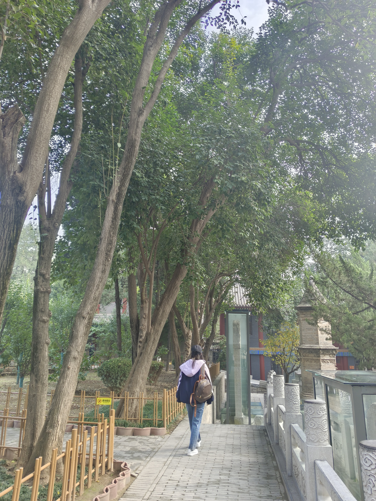
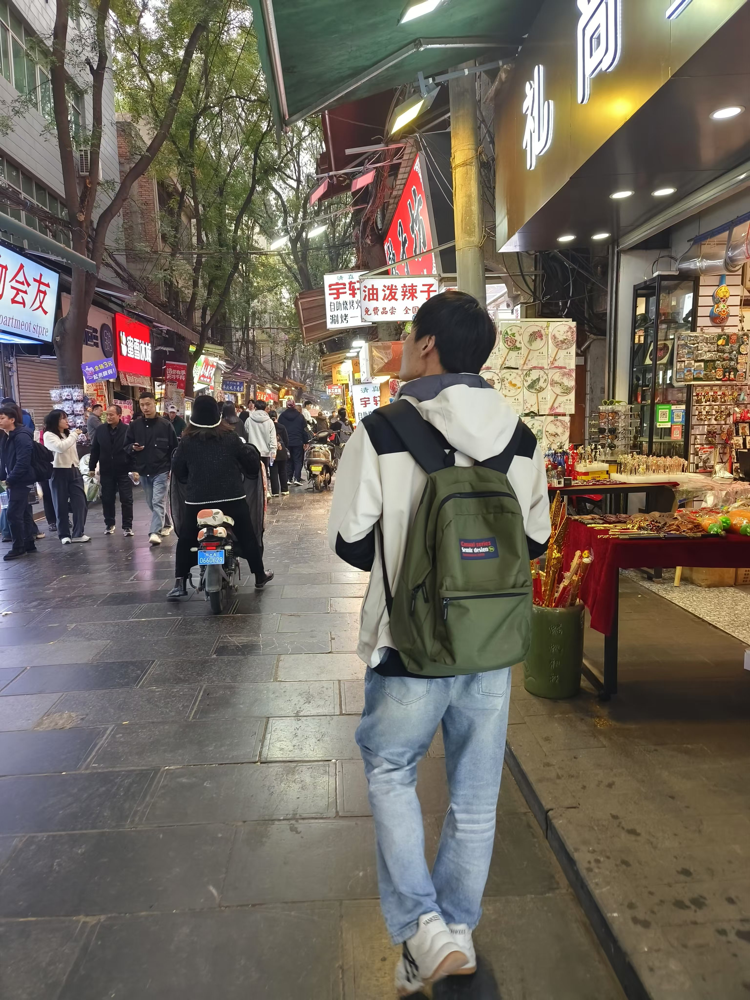
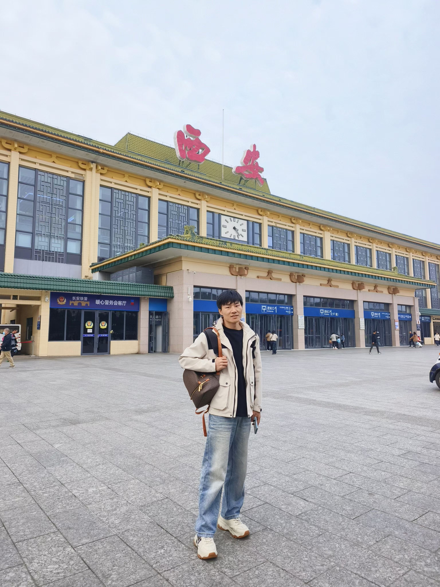
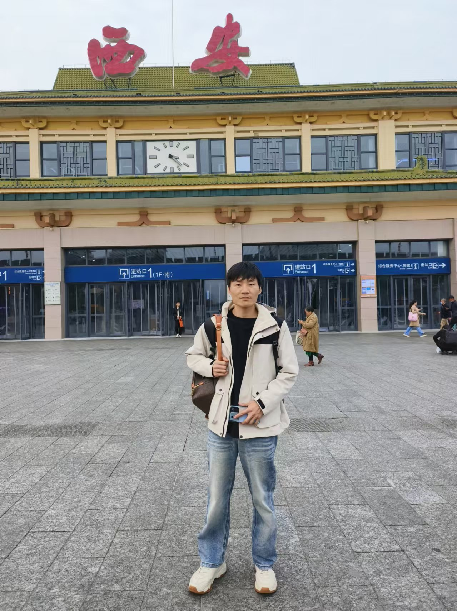
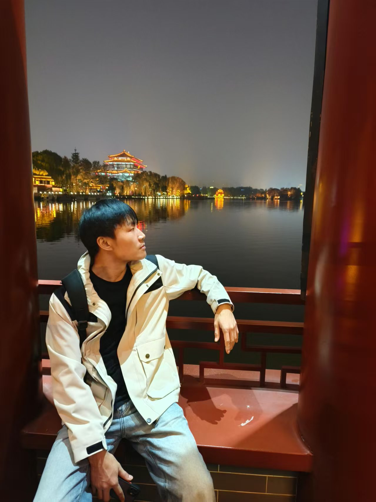
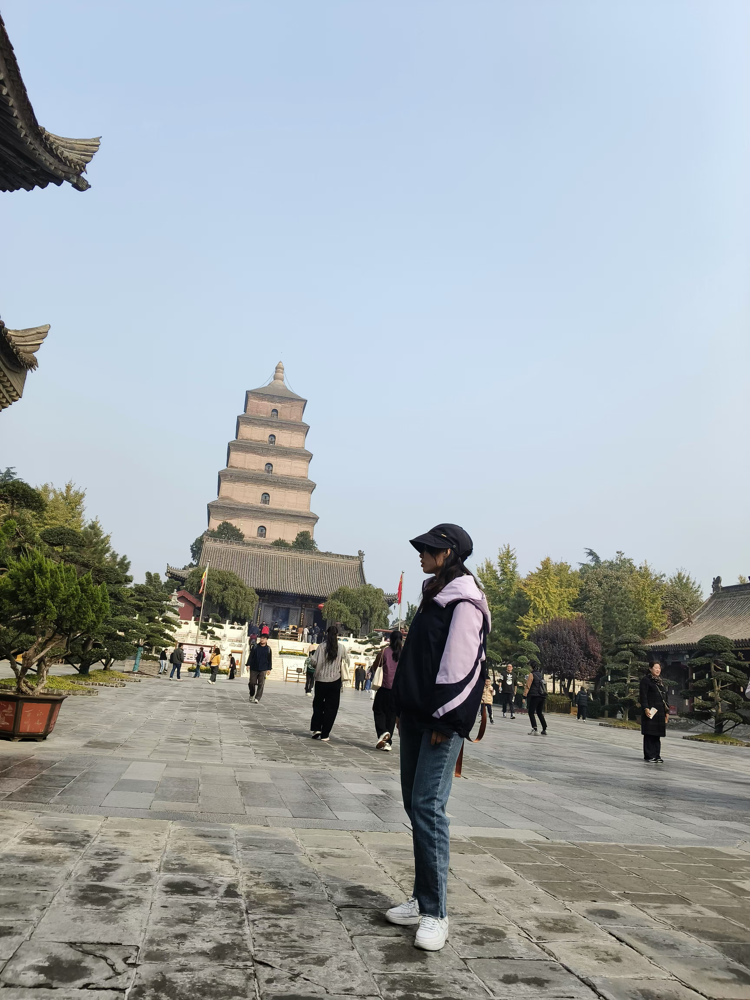

# 西安旅游

## 西安之行

旅行的最后一天，去了一家本地小馆，点了一份 酸汤水饺 和 油泼面，两份口味都不错 。吃完饭之后，我们两人骑行13.1公里，直达西安北站。此次骑行，一路欢声笑语，永生难忘 ♥️

靓女最喜欢的背影

俊男的背影

打卡一下西安站，从这里下车可以更快到达西安景点哦，比西安北站更便捷。

在芙蓉园一晚的拍摄，小小自恋一下～

摆个pose 

## 不足之处

很多原来规划的节目都没去看，特别是不夜城的景点演出，我们是一个没赶上，就只去那里吃小吃去了😭
下次一定要把演出的时间点安排好。